# Analyze, Visualize and  Predict flight delays in US in 2015
___

In this notebook, we develop a model aimed at predicting flight delays at take-off. The purpose is not to obtain the best possible prediction but rather to emphasize on the various steps needed to build such a model. Along this path, we then put in evidence some **basic but important** concepts. Among then, we comment on the importance of the separation of the dataset during the training stage and how **cross-validation** helps in determing accurate model parameters. We show how to build **linear** and **polynomial** models for **univariate** or **multivariate regressions** and also, we give some insight on the reason why **regularisation** helps us in developing models that generalize well. 

____
From a **_technical point of view_**, the main aspects of python covered throughout the notebook are:
- **visualization**: matplolib, seaborn, basemap
- **data manipulation**: pandas, numpy
- **modeling**: sklearn, scipy
- **class definition**: regression, figures

___

This notebook is composed of three parts: cleaning (section 1), exploration (section 2) and modeling (section 3).

**Overview of the dataset**(#overview) <br>

**1. CLEANING DATASET** (#1)
- 1.1 Converting format of date and time (#1.1)
- 1.2 Handling missing values (#1.2)

**2. EXPLORATION DATASET**(#2) <br>
   - ***2.1 Relation between delay and airlines***(#2.1)
      * 2.1.1 Basic statistical description of airlines(#2.1.1)
      * 2.1.2 Delays distribution: establishing the ranking of airlines(#2.1.2) 
   - ***2.2 Relation between delays and arrival/departure*** <br>(#2.2)
   - ***2.3 Relation between delay and the origin airport*** <br>(#2.3)
     * 2.3.1 Geographical area covered by airlines  <br>(#2.3.1)
     * 2.3.2 How the origin airport impact delays <br>(#2.3.2)
     * 2.3.3 Flights with usual delays ? <br>(#2.3.3)
   - ***2.4 Relation between delay and departure time***(#2.4) <br>

**3. MODELLING TO PREDICT FLIGHT DELAY**(#3) <br>
   - ***3.1 Model no.1: one airline, one airport***(#3.1)
      * 3.1.1 Pitfalls(#3.1.1)
      * 3.1.2 Polynomial degree: splitting the dataset(#3.1.2)
      * 3.1.3 Model test: prediction of end-January delays(#3.1.3)
   - ***3.2 Model no.2: one airline, all airports***(#3.2)
      * 3.2.1 Linear regression(#3.2.1)  
      * 3.2.2 Polynomial regression(#3.2.2)
      * 3.2.3 Setting the free parameters(#3.2.3)
      * 3.2.4 Model test: prediction of end-January delays(#3.2.4)
   - ***3.3 Model no.3: Accounting for destinations***(#3.3)
       * 3.3.1 Choice of the free parameters(#3.3.1)
       * 3.3.2 Model test: prediction of end-January delays(#3.3.2) 
   
**Conclusion**(#conclusion)


___
## Overview of the dataset <a name="overview"></a>

The U.S. Department of Transportation's (DOT) Bureau of Transportation Statistics tracks the on-time performance of domestic flights operated by large air carriers. Summary information on the number of on-time, delayed, canceled, and diverted flights is published in DOT's monthly Air Travel Consumer Report and in this dataset of 2015 flight delays and cancellations. You can download this dataset from Kaggle at this [link](https://www.kaggle.com/usdot/flight-delays).


```python
import datetime, warnings, scipy 
import pandas as pd
import numpy as np
import seaborn as sns
import matplotlib as mpl
import matplotlib.pyplot as plt
import matplotlib.patches as patches
from matplotlib.patches import ConnectionPatch
from collections import OrderedDict
from matplotlib.gridspec import GridSpec
from mpl_toolkits.basemap import Basemap
from sklearn import metrics, linear_model
from sklearn.preprocessing import PolynomialFeatures, StandardScaler
from sklearn.preprocessing import LabelEncoder, OneHotEncoder
from sklearn.model_selection import train_test_split, cross_val_score, cross_val_predict
from scipy.optimize import curve_fit
plt.rcParams["patch.force_edgecolor"] = True
plt.style.use('fivethirtyeight')
mpl.rc('patch', edgecolor = 'dimgray', linewidth=1)
from IPython.core.interactiveshell import InteractiveShell
from PIL import Image
InteractiveShell.ast_node_interactivity = "last_expr"
pd.options.display.max_columns = 50
%matplotlib inline
warnings.filterwarnings("ignore")
```

Let's read and explore the input dataset:


```python
df = pd.read_csv('./input/flights.csv', low_memory=False)
print('Dataframe dimensions:', df.shape)
#____________________________________________________________
# gives some infos on columns types and number of null values
tab_info=pd.DataFrame(df.dtypes).T.rename(index={0:'column type'})
tab_info=tab_info.append(pd.DataFrame(df.isnull().sum()).T.rename(index={0:'null values (nb)'}))
tab_info=tab_info.append(pd.DataFrame(df.isnull().sum()/df.shape[0]*100)
                         .T.rename(index={0:'null values (%)'}))
tab_info
```

    Dataframe dimensions: (5819079, 31)


<div>
<style scoped>
    .dataframe tbody tr th:only-of-type {
        vertical-align: middle;
    }

    .dataframe tbody tr th {
        vertical-align: top;
    }

    .dataframe thead th {
        text-align: right;
    }
</style>
<table border="1" class="dataframe">
  <thead>
    <tr style="text-align: right;">
      <th></th>
      <th>YEAR</th>
      <th>MONTH</th>
      <th>DAY</th>
      <th>DAY_OF_WEEK</th>
      <th>AIRLINE</th>
      <th>FLIGHT_NUMBER</th>
      <th>TAIL_NUMBER</th>
      <th>ORIGIN_AIRPORT</th>
      <th>DESTINATION_AIRPORT</th>
      <th>SCHEDULED_DEPARTURE</th>
      <th>DEPARTURE_TIME</th>
      <th>DEPARTURE_DELAY</th>
      <th>TAXI_OUT</th>
      <th>WHEELS_OFF</th>
      <th>SCHEDULED_TIME</th>
      <th>ELAPSED_TIME</th>
      <th>AIR_TIME</th>
      <th>DISTANCE</th>
      <th>WHEELS_ON</th>
      <th>TAXI_IN</th>
      <th>SCHEDULED_ARRIVAL</th>
      <th>ARRIVAL_TIME</th>
      <th>ARRIVAL_DELAY</th>
      <th>DIVERTED</th>
      <th>CANCELLED</th>
      <th>CANCELLATION_REASON</th>
      <th>AIR_SYSTEM_DELAY</th>
      <th>SECURITY_DELAY</th>
      <th>AIRLINE_DELAY</th>
      <th>LATE_AIRCRAFT_DELAY</th>
      <th>WEATHER_DELAY</th>
    </tr>
  </thead>
  <tbody>
    <tr>
      <th>column type</th>
      <td>int64</td>
      <td>int64</td>
      <td>int64</td>
      <td>int64</td>
      <td>object</td>
      <td>int64</td>
      <td>object</td>
      <td>object</td>
      <td>object</td>
      <td>int64</td>
      <td>float64</td>
      <td>float64</td>
      <td>float64</td>
      <td>float64</td>
      <td>float64</td>
      <td>float64</td>
      <td>float64</td>
      <td>int64</td>
      <td>float64</td>
      <td>float64</td>
      <td>int64</td>
      <td>float64</td>
      <td>float64</td>
      <td>int64</td>
      <td>int64</td>
      <td>object</td>
      <td>float64</td>
      <td>float64</td>
      <td>float64</td>
      <td>float64</td>
      <td>float64</td>
    </tr>
    <tr>
      <th>null values (nb)</th>
      <td>0</td>
      <td>0</td>
      <td>0</td>
      <td>0</td>
      <td>0</td>
      <td>0</td>
      <td>14721</td>
      <td>0</td>
      <td>0</td>
      <td>0</td>
      <td>86153</td>
      <td>86153</td>
      <td>89047</td>
      <td>89047</td>
      <td>6</td>
      <td>105071</td>
      <td>105071</td>
      <td>0</td>
      <td>92513</td>
      <td>92513</td>
      <td>0</td>
      <td>92513</td>
      <td>105071</td>
      <td>0</td>
      <td>0</td>
      <td>5729195</td>
      <td>4755640</td>
      <td>4755640</td>
      <td>4755640</td>
      <td>4755640</td>
      <td>4755640</td>
    </tr>
    <tr>
      <th>null values (%)</th>
      <td>0</td>
      <td>0</td>
      <td>0</td>
      <td>0</td>
      <td>0</td>
      <td>0</td>
      <td>0.252978</td>
      <td>0</td>
      <td>0</td>
      <td>0</td>
      <td>1.48053</td>
      <td>1.48053</td>
      <td>1.53026</td>
      <td>1.53026</td>
      <td>0.000103109</td>
      <td>1.80563</td>
      <td>1.80563</td>
      <td>0</td>
      <td>1.58982</td>
      <td>1.58982</td>
      <td>0</td>
      <td>1.58982</td>
      <td>1.80563</td>
      <td>0</td>
      <td>0</td>
      <td>98.4554</td>
      <td>81.725</td>
      <td>81.725</td>
      <td>81.725</td>
      <td>81.725</td>
      <td>81.725</td>
    </tr>
  </tbody>
</table>
</div>


Each entry of the `flights.csv` file corresponds to a flight and we see that more than 5'800'000 flights have been recorded in 2015. These flights are described according to 31 variables. A description of these variables can be found [here](https://www.transtats.bts.gov/DL_SelectFields.asp?Table_ID=236&DB_Short_Name=On-Time), meanwhile the meaning of the variables that will be used in this notebook are briefly recalled below:

- **YEAR, MONTH, DAY, DAY_OF_WEEK**: dates of the flight <br/>
- **AIRLINE**: An identification number assigned by US DOT to identify a unique airline <br/>
- **ORIGIN_AIRPORT** and **DESTINATION_AIRPORT**: code attributed by IATA to identify the airports <br/>
- **SCHEDULED_DEPARTURE** and **SCHEDULED_ARRIVAL** : scheduled times of take-off and landing <br/> 
- **DEPARTURE_TIME** and **ARRIVAL_TIME**: real times at which take-off and landing took place <br/> 
- **DEPARTURE_DELAY** and **ARRIVAL_DELAY**: difference (in minutes) between planned and real times <br/> 
- **DISTANCE**: distance (in miles)  <br/>

An additional file of this dataset, the `airports.csv` file, gives a more exhaustive description of the airports:


```python
airports = pd.read_csv("./input/airports.csv")
print(airports.head())
```

      IATA_CODE                              AIRPORT         CITY STATE COUNTRY  \
    0       ABE  Lehigh Valley International Airport    Allentown    PA     USA   
    1       ABI             Abilene Regional Airport      Abilene    TX     USA   
    2       ABQ    Albuquerque International Sunport  Albuquerque    NM     USA   
    3       ABR            Aberdeen Regional Airport     Aberdeen    SD     USA   
    4       ABY   Southwest Georgia Regional Airport       Albany    GA     USA   
    
       LATITUDE  LONGITUDE  
    0  40.65236  -75.44040  
    1  32.41132  -99.68190  
    2  35.04022 -106.60919  
    3  45.44906  -98.42183  
    4  31.53552  -84.19447  


To have a global overview of the geographical area covered in this dataset, we can plot the airports location and indicate the number of flights recorded during year 2015 in each of them:


```python
count_flights = df['ORIGIN_AIRPORT'].value_counts()
#___________________________
plt.figure(figsize=(11,11))
#________________________________________
# define properties of markers and labels
colors = ['yellow', 'red', 'lightblue', 'purple', 'green', 'orange']
size_limits = [1, 100, 1000, 10000, 100000, 1000000]
labels = []
for i in range(len(size_limits)-1):
    labels.append("{} <.< {}".format(size_limits[i], size_limits[i+1])) 
#____________________________________________________________
map = Basemap(resolution='i',llcrnrlon=-180, urcrnrlon=-50,
              llcrnrlat=10, urcrnrlat=75, lat_0=0, lon_0=0,)
map.shadedrelief()
map.drawcoastlines()
map.drawcountries(linewidth = 3)
map.drawstates(color='0.3')
#_____________________
# put airports on map
for index, (code, y,x) in airports[['IATA_CODE', 'LATITUDE', 'LONGITUDE']].iterrows():
    x, y = map(x, y)
    isize = [i for i, val in enumerate(size_limits) if val < count_flights[code]]
    ind = isize[-1]
    map.plot(x, y, marker='o', markersize = ind+5, markeredgewidth = 1, color = colors[ind],
             markeredgecolor='k', label = labels[ind])
#_____________________________________________
# remove duplicate labels and set their order
handles, labels = plt.gca().get_legend_handles_labels()
by_label = OrderedDict(zip(labels, handles))
key_order = ('1 <.< 100', '100 <.< 1000', '1000 <.< 10000',
             '10000 <.< 100000', '100000 <.< 1000000')
new_label = OrderedDict()
for key in key_order:
    new_label[key] = by_label[key]
plt.legend(new_label.values(), new_label.keys(), loc = 1, prop= {'size':11},
           title='Number of flights per year', frameon = True, framealpha = 1)
plt.show()
```


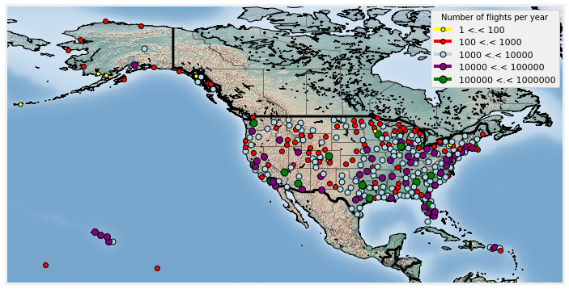


Given the large size of the dataset, it is better to consider only a subset of the data in order to reduce the computational time. We will just keep the flights from January 2015:


```python
df = df[df['MONTH'] == 1]
df.shape
```


    (469968, 31)


In the subset of flights in January 2015, we have approximately **470,000** flights, which is good enougth to experiment different algorithms for prediction of flight delay.

___
# I. CLEANING DATASET <a name="1"></a>
___ 
## 1.1 Converting format of dates and times <a name="1.1"></a>


In the initial dataframe, dates are coded according to 4 variables: **YEAR, MONTH, DAY**, and **DAY_OF_WEEK**. In fact, python offers the **_datetime_** format which is really convenient to work with dates and times. Let's convert the dates in this format:


```python
df['DATE'] = pd.to_datetime(df[['YEAR','MONTH', 'DAY']])
```

Moreover, in the **SCHEDULED_DEPARTURE** variable, the hour of the take-off is coded as a float where the two first digits indicate the hour and the two last, the minutes. This format is not convenient and should be converted. Finally, we merge the take-off hour with the flight date. The helper functions to proceed with these transformations are defined as following:


```python
#_________________________________________________________
# Function that convert the 'HHMM' string to datetime.time
def format_heure(chaine):
    if pd.isnull(chaine):
        return np.nan
    else:
        if chaine == 2400: chaine = 0
        chaine = "{0:04d}".format(int(chaine))
        heure = datetime.time(int(chaine[0:2]), int(chaine[2:4]))
        return heure
#_____________________________________________________________________
# Function that combines a date and time to produce a datetime.datetime
def combine_date_heure(x):
    if pd.isnull(x[0]) or pd.isnull(x[1]):
        return np.nan
    else:
        return datetime.datetime.combine(x[0],x[1])
#_______________________________________________________________________________
# Function that combine two columns of the dataframe to create a datetime format
def create_flight_time(df, col):    
    liste = []
    for index, cols in df[['DATE', col]].iterrows():    
        if pd.isnull(cols[1]):
            liste.append(np.nan)
        elif float(cols[1]) == 2400:
            cols[0] += datetime.timedelta(days=1)
            cols[1] = datetime.time(0,0)
            liste.append(combine_date_heure(cols))
        else:
            cols[1] = format_heure(cols[1])
            liste.append(combine_date_heure(cols))
    return pd.Series(liste)
```

Call the functions above to modify the dataframe:


```python
df['SCHEDULED_DEPARTURE'] = create_flight_time(df, 'SCHEDULED_DEPARTURE')
df['DEPARTURE_TIME'] = df['DEPARTURE_TIME'].apply(format_heure)
df['SCHEDULED_ARRIVAL'] = df['SCHEDULED_ARRIVAL'].apply(format_heure)
df['ARRIVAL_TIME'] = df['ARRIVAL_TIME'].apply(format_heure)
#__________________________________________________________________________
df.loc[:5, ['SCHEDULED_DEPARTURE', 'SCHEDULED_ARRIVAL', 'DEPARTURE_TIME',
             'ARRIVAL_TIME', 'DEPARTURE_DELAY', 'ARRIVAL_DELAY']]
```


<div>
<style scoped>
    .dataframe tbody tr th:only-of-type {
        vertical-align: middle;
    }

    .dataframe tbody tr th {
        vertical-align: top;
    }

    .dataframe thead th {
        text-align: right;
    }
</style>
<table border="1" class="dataframe">
  <thead>
    <tr style="text-align: right;">
      <th></th>
      <th>SCHEDULED_DEPARTURE</th>
      <th>SCHEDULED_ARRIVAL</th>
      <th>DEPARTURE_TIME</th>
      <th>ARRIVAL_TIME</th>
      <th>DEPARTURE_DELAY</th>
      <th>ARRIVAL_DELAY</th>
    </tr>
  </thead>
  <tbody>
    <tr>
      <th>0</th>
      <td>2015-01-01 00:05:00</td>
      <td>04:30:00</td>
      <td>23:54:00</td>
      <td>04:08:00</td>
      <td>-11.0</td>
      <td>-22.0</td>
    </tr>
    <tr>
      <th>1</th>
      <td>2015-01-01 00:10:00</td>
      <td>07:50:00</td>
      <td>00:02:00</td>
      <td>07:41:00</td>
      <td>-8.0</td>
      <td>-9.0</td>
    </tr>
    <tr>
      <th>2</th>
      <td>2015-01-01 00:20:00</td>
      <td>08:06:00</td>
      <td>00:18:00</td>
      <td>08:11:00</td>
      <td>-2.0</td>
      <td>5.0</td>
    </tr>
    <tr>
      <th>3</th>
      <td>2015-01-01 00:20:00</td>
      <td>08:05:00</td>
      <td>00:15:00</td>
      <td>07:56:00</td>
      <td>-5.0</td>
      <td>-9.0</td>
    </tr>
    <tr>
      <th>4</th>
      <td>2015-01-01 00:25:00</td>
      <td>03:20:00</td>
      <td>00:24:00</td>
      <td>02:59:00</td>
      <td>-1.0</td>
      <td>-21.0</td>
    </tr>
    <tr>
      <th>5</th>
      <td>2015-01-01 00:25:00</td>
      <td>06:02:00</td>
      <td>00:20:00</td>
      <td>06:10:00</td>
      <td>-5.0</td>
      <td>8.0</td>
    </tr>
  </tbody>
</table>
</div>


Note that in practice, the content of the **DEPARTURE_TIME** and **ARRIVAL_TIME** variables can be a bit misleading since they don't contain the dates. For exemple, in the first entry of the dataframe, the scheduled departure is at 0h05 the 1st of January. The **DEPARTURE_TIME** variable indicates 23h54 and we thus don't know if the flight leaved before time or if there was a large delay. Hence, the **DEPARTURE_DELAY** and **ARRIVAL_DELAY** variables proves more useful since they directly provides the delays in minutes. Hence, in what follows, we will not use the **DEPARTURE_TIME** and **ARRIVAL_TIME** variables.

## 1.2 Handling missing values

Finally, we can clean the dataframe throwing the unused variables and re-organize the columns to ease its reading:


```python
variables_to_remove = ['TAXI_OUT', 'TAXI_IN', 'WHEELS_ON', 'WHEELS_OFF', 'YEAR', 
                       'MONTH','DAY','DAY_OF_WEEK','DATE', 'AIR_SYSTEM_DELAY',
                       'SECURITY_DELAY', 'AIRLINE_DELAY', 'LATE_AIRCRAFT_DELAY',
                       'WEATHER_DELAY', 'DIVERTED', 'CANCELLED', 'CANCELLATION_REASON',
                       'FLIGHT_NUMBER', 'TAIL_NUMBER', 'AIR_TIME']
df.drop(variables_to_remove, axis = 1, inplace = True)
df = df[['AIRLINE', 'ORIGIN_AIRPORT', 'DESTINATION_AIRPORT',
        'SCHEDULED_DEPARTURE', 'DEPARTURE_TIME', 'DEPARTURE_DELAY',
        'SCHEDULED_ARRIVAL', 'ARRIVAL_TIME', 'ARRIVAL_DELAY',
        'SCHEDULED_TIME', 'ELAPSED_TIME']]
df[:5]
```


<div>
<style scoped>
    .dataframe tbody tr th:only-of-type {
        vertical-align: middle;
    }

    .dataframe tbody tr th {
        vertical-align: top;
    }

    .dataframe thead th {
        text-align: right;
    }
</style>
<table border="1" class="dataframe">
  <thead>
    <tr style="text-align: right;">
      <th></th>
      <th>AIRLINE</th>
      <th>ORIGIN_AIRPORT</th>
      <th>DESTINATION_AIRPORT</th>
      <th>SCHEDULED_DEPARTURE</th>
      <th>DEPARTURE_TIME</th>
      <th>DEPARTURE_DELAY</th>
      <th>SCHEDULED_ARRIVAL</th>
      <th>ARRIVAL_TIME</th>
      <th>ARRIVAL_DELAY</th>
      <th>SCHEDULED_TIME</th>
      <th>ELAPSED_TIME</th>
    </tr>
  </thead>
  <tbody>
    <tr>
      <th>0</th>
      <td>AS</td>
      <td>ANC</td>
      <td>SEA</td>
      <td>2015-01-01 00:05:00</td>
      <td>23:54:00</td>
      <td>-11.0</td>
      <td>04:30:00</td>
      <td>04:08:00</td>
      <td>-22.0</td>
      <td>205.0</td>
      <td>194.0</td>
    </tr>
    <tr>
      <th>1</th>
      <td>AA</td>
      <td>LAX</td>
      <td>PBI</td>
      <td>2015-01-01 00:10:00</td>
      <td>00:02:00</td>
      <td>-8.0</td>
      <td>07:50:00</td>
      <td>07:41:00</td>
      <td>-9.0</td>
      <td>280.0</td>
      <td>279.0</td>
    </tr>
    <tr>
      <th>2</th>
      <td>US</td>
      <td>SFO</td>
      <td>CLT</td>
      <td>2015-01-01 00:20:00</td>
      <td>00:18:00</td>
      <td>-2.0</td>
      <td>08:06:00</td>
      <td>08:11:00</td>
      <td>5.0</td>
      <td>286.0</td>
      <td>293.0</td>
    </tr>
    <tr>
      <th>3</th>
      <td>AA</td>
      <td>LAX</td>
      <td>MIA</td>
      <td>2015-01-01 00:20:00</td>
      <td>00:15:00</td>
      <td>-5.0</td>
      <td>08:05:00</td>
      <td>07:56:00</td>
      <td>-9.0</td>
      <td>285.0</td>
      <td>281.0</td>
    </tr>
    <tr>
      <th>4</th>
      <td>AS</td>
      <td>SEA</td>
      <td>ANC</td>
      <td>2015-01-01 00:25:00</td>
      <td>00:24:00</td>
      <td>-1.0</td>
      <td>03:20:00</td>
      <td>02:59:00</td>
      <td>-21.0</td>
      <td>235.0</td>
      <td>215.0</td>
    </tr>
  </tbody>
</table>
</div>


At this stage, let's examine how complete the dataset is:


```python
missing_df = df.isnull().sum(axis=0).reset_index()
missing_df.columns = ['variable', 'missing values']
missing_df['filling factor (%)']=(df.shape[0]-missing_df['missing values'])/df.shape[0]*100
missing_df.sort_values('filling factor (%)').reset_index(drop = True)
```


<div>
<style scoped>
    .dataframe tbody tr th:only-of-type {
        vertical-align: middle;
    }

    .dataframe tbody tr th {
        vertical-align: top;
    }

    .dataframe thead th {
        text-align: right;
    }
</style>
<table border="1" class="dataframe">
  <thead>
    <tr style="text-align: right;">
      <th></th>
      <th>variable</th>
      <th>missing values</th>
      <th>filling factor (%)</th>
    </tr>
  </thead>
  <tbody>
    <tr>
      <th>0</th>
      <td>ARRIVAL_DELAY</td>
      <td>12955</td>
      <td>97.243429</td>
    </tr>
    <tr>
      <th>1</th>
      <td>ELAPSED_TIME</td>
      <td>12955</td>
      <td>97.243429</td>
    </tr>
    <tr>
      <th>2</th>
      <td>ARRIVAL_TIME</td>
      <td>12271</td>
      <td>97.388971</td>
    </tr>
    <tr>
      <th>3</th>
      <td>DEPARTURE_TIME</td>
      <td>11657</td>
      <td>97.519618</td>
    </tr>
    <tr>
      <th>4</th>
      <td>DEPARTURE_DELAY</td>
      <td>11657</td>
      <td>97.519618</td>
    </tr>
    <tr>
      <th>5</th>
      <td>AIRLINE</td>
      <td>0</td>
      <td>100.000000</td>
    </tr>
    <tr>
      <th>6</th>
      <td>ORIGIN_AIRPORT</td>
      <td>0</td>
      <td>100.000000</td>
    </tr>
    <tr>
      <th>7</th>
      <td>DESTINATION_AIRPORT</td>
      <td>0</td>
      <td>100.000000</td>
    </tr>
    <tr>
      <th>8</th>
      <td>SCHEDULED_DEPARTURE</td>
      <td>0</td>
      <td>100.000000</td>
    </tr>
    <tr>
      <th>9</th>
      <td>SCHEDULED_ARRIVAL</td>
      <td>0</td>
      <td>100.000000</td>
    </tr>
    <tr>
      <th>10</th>
      <td>SCHEDULED_TIME</td>
      <td>0</td>
      <td>100.000000</td>
    </tr>
  </tbody>
</table>
</div>


We see that the variables filling factor is quite good (> 97%). Since the scope of this work is not to establish the state-of-the-art in predicting flight delays, we can proceed without trying to impute what's missing and simply remove the entries that contain missing values.


```python
df.dropna(inplace = True)
```

# 2. EXPLORATION DATASET <a name="2"></a>


## 2.1 Relation  between delay and airlines <a name="2.1"></a>

As said earlier, the **AIRLINE** variable contains the airline abreviations. Their full names can be retrieved from the `airlines.csv` file.


```python
airlines_names = pd.read_csv('./input/airlines.csv')
airlines_names
```


<div>
<style scoped>
    .dataframe tbody tr th:only-of-type {
        vertical-align: middle;
    }

    .dataframe tbody tr th {
        vertical-align: top;
    }

    .dataframe thead th {
        text-align: right;
    }
</style>
<table border="1" class="dataframe">
  <thead>
    <tr style="text-align: right;">
      <th></th>
      <th>IATA_CODE</th>
      <th>AIRLINE</th>
    </tr>
  </thead>
  <tbody>
    <tr>
      <th>0</th>
      <td>UA</td>
      <td>United Air Lines Inc.</td>
    </tr>
    <tr>
      <th>1</th>
      <td>AA</td>
      <td>American Airlines Inc.</td>
    </tr>
    <tr>
      <th>2</th>
      <td>US</td>
      <td>US Airways Inc.</td>
    </tr>
    <tr>
      <th>3</th>
      <td>F9</td>
      <td>Frontier Airlines Inc.</td>
    </tr>
    <tr>
      <th>4</th>
      <td>B6</td>
      <td>JetBlue Airways</td>
    </tr>
    <tr>
      <th>5</th>
      <td>OO</td>
      <td>Skywest Airlines Inc.</td>
    </tr>
    <tr>
      <th>6</th>
      <td>AS</td>
      <td>Alaska Airlines Inc.</td>
    </tr>
    <tr>
      <th>7</th>
      <td>NK</td>
      <td>Spirit Air Lines</td>
    </tr>
    <tr>
      <th>8</th>
      <td>WN</td>
      <td>Southwest Airlines Co.</td>
    </tr>
    <tr>
      <th>9</th>
      <td>DL</td>
      <td>Delta Air Lines Inc.</td>
    </tr>
    <tr>
      <th>10</th>
      <td>EV</td>
      <td>Atlantic Southeast Airlines</td>
    </tr>
    <tr>
      <th>11</th>
      <td>HA</td>
      <td>Hawaiian Airlines Inc.</td>
    </tr>
    <tr>
      <th>12</th>
      <td>MQ</td>
      <td>American Eagle Airlines Inc.</td>
    </tr>
    <tr>
      <th>13</th>
      <td>VX</td>
      <td>Virgin America</td>
    </tr>
  </tbody>
</table>
</div>


Put the content of this dataframe in a dictionary for further use:


```python
abbr_companies = airlines_names.set_index('IATA_CODE')['AIRLINE'].to_dict()
abbr_companies
```


    {'UA': 'United Air Lines Inc.',
     'AA': 'American Airlines Inc.',
     'US': 'US Airways Inc.',
     'F9': 'Frontier Airlines Inc.',
     'B6': 'JetBlue Airways',
     'OO': 'Skywest Airlines Inc.',
     'AS': 'Alaska Airlines Inc.',
     'NK': 'Spirit Air Lines',
     'WN': 'Southwest Airlines Co.',
     'DL': 'Delta Air Lines Inc.',
     'EV': 'Atlantic Southeast Airlines',
     'HA': 'Hawaiian Airlines Inc.',
     'MQ': 'American Eagle Airlines Inc.',
     'VX': 'Virgin America'}


___
### 2.1 Basic statistical description of airlines <a name="2.1"></a>

As a first step, we consider all the flights from all carriers. Here, the aim is to classify the airlines with respect to their punctuality and for that purpose, we compute a few basic statisticial parameters:


```python
#__________________________________________________________________
# function that extract statistical parameters from a grouby objet:
def get_stats(group):
    return {'min': group.min(), 'max': group.max(),
            'count': group.count(), 'mean': group.mean()}
#_______________________________________________________________
# Creation of a dataframe with statitical infos on each airline:
global_stats = df['DEPARTURE_DELAY'].groupby(df['AIRLINE']).apply(get_stats).unstack()
global_stats = global_stats.sort_values('count')
global_stats
```


<div>
<style scoped>
    .dataframe tbody tr th:only-of-type {
        vertical-align: middle;
    }

    .dataframe tbody tr th {
        vertical-align: top;
    }

    .dataframe thead th {
        text-align: right;
    }
</style>
<table border="1" class="dataframe">
  <thead>
    <tr style="text-align: right;">
      <th></th>
      <th>min</th>
      <th>max</th>
      <th>count</th>
      <th>mean</th>
    </tr>
    <tr>
      <th>AIRLINE</th>
      <th></th>
      <th></th>
      <th></th>
      <th></th>
    </tr>
  </thead>
  <tbody>
    <tr>
      <th>VX</th>
      <td>-20.0</td>
      <td>397.0</td>
      <td>4647.0</td>
      <td>6.896277</td>
    </tr>
    <tr>
      <th>HA</th>
      <td>-26.0</td>
      <td>1003.0</td>
      <td>6408.0</td>
      <td>1.311954</td>
    </tr>
    <tr>
      <th>F9</th>
      <td>-32.0</td>
      <td>696.0</td>
      <td>6735.0</td>
      <td>17.910765</td>
    </tr>
    <tr>
      <th>NK</th>
      <td>-28.0</td>
      <td>557.0</td>
      <td>8632.0</td>
      <td>13.073100</td>
    </tr>
    <tr>
      <th>AS</th>
      <td>-47.0</td>
      <td>444.0</td>
      <td>13151.0</td>
      <td>3.072086</td>
    </tr>
    <tr>
      <th>B6</th>
      <td>-27.0</td>
      <td>500.0</td>
      <td>20482.0</td>
      <td>9.988331</td>
    </tr>
    <tr>
      <th>MQ</th>
      <td>-29.0</td>
      <td>780.0</td>
      <td>27568.0</td>
      <td>15.995865</td>
    </tr>
    <tr>
      <th>US</th>
      <td>-26.0</td>
      <td>638.0</td>
      <td>32478.0</td>
      <td>5.175011</td>
    </tr>
    <tr>
      <th>UA</th>
      <td>-40.0</td>
      <td>886.0</td>
      <td>37363.0</td>
      <td>13.885555</td>
    </tr>
    <tr>
      <th>AA</th>
      <td>-29.0</td>
      <td>1988.0</td>
      <td>43074.0</td>
      <td>10.548335</td>
    </tr>
    <tr>
      <th>OO</th>
      <td>-48.0</td>
      <td>931.0</td>
      <td>46655.0</td>
      <td>11.999957</td>
    </tr>
    <tr>
      <th>EV</th>
      <td>-33.0</td>
      <td>726.0</td>
      <td>48084.0</td>
      <td>9.678895</td>
    </tr>
    <tr>
      <th>DL</th>
      <td>-26.0</td>
      <td>1184.0</td>
      <td>63676.0</td>
      <td>5.888215</td>
    </tr>
    <tr>
      <th>WN</th>
      <td>-15.0</td>
      <td>604.0</td>
      <td>98060.0</td>
      <td>9.453426</td>
    </tr>
  </tbody>
</table>
</div>


Now, construct some graphics in order to facilitate the lecture of that information:


```python
font = {'family' : 'normal', 'weight' : 'bold', 'size'   : 15}
mpl.rc('font', **font)
import matplotlib.patches as mpatches
#__________________________________________________________________
# extract a subset of columns and redefine the airlines labeling 
df2 = df.loc[:, ['AIRLINE', 'DEPARTURE_DELAY']]
df2['AIRLINE'] = df2['AIRLINE'].replace(abbr_companies)
#________________________________________________________________________
colors = ['royalblue', 'grey', 'wheat', 'c', 'firebrick', 'seagreen', 'lightskyblue',
          'lightcoral', 'yellowgreen', 'gold', 'tomato', 'violet', 'aquamarine', 'chartreuse']
#___________________________________
fig = plt.figure(1, figsize=(16,15))
gs=GridSpec(2,2)             
ax1=fig.add_subplot(gs[0,0]) 
ax2=fig.add_subplot(gs[0,1]) 
ax3=fig.add_subplot(gs[1,:]) 
#------------------------------
# Pie chart nº1: nb of flights
#------------------------------
labels = [s for s in  global_stats.index]
sizes  = global_stats['count'].values
explode = [0.3 if sizes[i] < 20000 else 0.0 for i in range(len(abbr_companies))]
patches, texts, autotexts = ax1.pie(sizes, explode = explode,
                                labels=labels, colors = colors,  autopct='%1.0f%%',
                                shadow=False, startangle=0)
for i in range(len(abbr_companies)): 
    texts[i].set_fontsize(14)
ax1.axis('equal')
ax1.set_title('% of flights per company', bbox={'facecolor':'midnightblue', 'pad':5},
              color = 'w',fontsize=18)
#_______________________________________________
# set the legend: abreviation -> airline name
comp_handler = []
for i in range(len(abbr_companies)):
    comp_handler.append(mpatches.Patch(color=colors[i],
            label = global_stats.index[i] + ': ' + abbr_companies[global_stats.index[i]]))
ax1.legend(handles=comp_handler, bbox_to_anchor=(0.2, 0.9), 
           fontsize = 13, bbox_transform=plt.gcf().transFigure)
#----------------------------------------
# Pie chart nº2: mean delay at departure
#----------------------------------------
sizes  = global_stats['mean'].values
sizes  = [max(s,0) for s in sizes]
explode = [0.0 if sizes[i] < 20000 else 0.01 for i in range(len(abbr_companies))]
patches, texts, autotexts = ax2.pie(sizes, explode = explode, labels = labels,
                                colors = colors, shadow=False, startangle=0,
                                autopct = lambda p :  '{:.0f}'.format(p * sum(sizes) / 100))
for i in range(len(abbr_companies)): 
    texts[i].set_fontsize(14)
ax2.axis('equal')
ax2.set_title('Mean delay at origin', bbox={'facecolor':'midnightblue', 'pad':5},
              color='w', fontsize=18)
#------------------------------------------------------
# striplot with all the values reported for the delays
#___________________________________________________________________
# redefine the colors for correspondance with the pie charts
colors = ['firebrick', 'gold', 'lightcoral', 'aquamarine', 'c', 'yellowgreen', 'grey',
          'seagreen', 'tomato', 'violet', 'wheat', 'chartreuse', 'lightskyblue', 'royalblue']
#___________________________________________________________________
ax3 = sns.stripplot(y="AIRLINE", x="DEPARTURE_DELAY", size = 4, palette = colors,
                    data=df2, linewidth = 0.5,  jitter=True)
plt.setp(ax3.get_xticklabels(), fontsize=14)
plt.setp(ax3.get_yticklabels(), fontsize=14)
ax3.set_xticklabels(['{:2.0f}h{:2.0f}m'.format(*[int(y) for y in divmod(x,60)])
                         for x in ax3.get_xticks()])
plt.xlabel('Departure delay', fontsize=18, bbox={'facecolor':'midnightblue', 'pad':5},
           color='w', labelpad=20)
ax3.yaxis.label.set_visible(False)
#________________________
plt.tight_layout(w_pad=3) 
```

    findfont: Font family ['normal'] not found. Falling back to DejaVu Sans.
    findfont: Font family ['normal'] not found. Falling back to DejaVu Sans.
    findfont: Font family ['normal'] not found. Falling back to DejaVu Sans.
    findfont: Font family ['normal'] not found. Falling back to DejaVu Sans.


Considering the first pie chart that gives the percentage of flights per airline, we see that there is some disparity between the carriers. For exemple, *Southwest Airlines* accounts for $\sim$20% of the flights which is similar to the number of flights chartered by the 7 tiniest airlines. However, if we have a look at the second pie chart, we see that here, on the contrary, the differences among airlines are less pronounced. Excluding *Hawaiian Airlines* and *Alaska Airlines* that report extremely low mean delays, we obtain that a value of **$\sim$11$\pm$7 minutes** would correctly represent all mean delays. Note that this value is quite low which mean that the standard for every airline is to respect the schedule !

Finally, the figure at the bottom makes a census of all the delays that were measured in January 2015. This representation gives a feeling on the dispersion of data and put in perspective the relative homogeneity that appeared in the second pie chart. Indeed, we see that while all mean delays are around 10 minutes, this low value is a consequence of the fact that a majority of flights take off on time. However, we see that occasionally, we can face really large delays that can reach a few tens of hours !

The large majority of short delays is visible in the next figure:


```python
#_____________________________________________
# Function that define how delays are grouped
delay_type = lambda x:((0,1)[x > 5],2)[x > 45]
df['DELAY_LEVEL'] = df['DEPARTURE_DELAY'].apply(delay_type)
#____________________________________________________
fig = plt.figure(1, figsize=(10,7))
ax = sns.countplot(y="AIRLINE", hue='DELAY_LEVEL', data=df)
#____________________________________________________________________________________
# replace the abbreviations by the full names of the companies and set the labels
labels = [abbr_companies[item.get_text()] for item in ax.get_yticklabels()]
ax.set_yticklabels(labels)
plt.setp(ax.get_xticklabels(), fontsize=12, weight = 'normal', rotation = 0);
plt.setp(ax.get_yticklabels(), fontsize=12, weight = 'bold', rotation = 0);
ax.yaxis.label.set_visible(False)
plt.xlabel('Flight count', fontsize=16, weight = 'bold', labelpad=10)
#________________
# Set the legend
L = plt.legend()
L.get_texts()[0].set_text('on time (t < 5 min)')
L.get_texts()[1].set_text('small delay (5 < t < 45 min)')
L.get_texts()[2].set_text('large delay (t > 45 min)')
plt.show()
```

    findfont: Font family ['normal'] not found. Falling back to DejaVu Sans.
    findfont: Font family ['normal'] not found. Falling back to DejaVu Sans.
    findfont: Font family ['normal'] not found. Falling back to DejaVu Sans.


This figure gives a count of the delays of less than 5 minutes, those in the range 5 < t < 45 min and finally, the delays greater than 45 minutes. Hence, we wee that independently of the airline, delays greater than 45 minutes only account for a few percents. However, the proportion of delays in these three groups depends on the airline: as an exemple, in the case of 
*SkyWest Airlines*, the delays greater than 45 minutes are only lower by $\sim$30% with respect to delays in the range 5 < t < 45 min. Things are better for *SoutWest Airlines*  since delays greater than 45 minutes are 4 times less frequent than delays in the range 5 < t < 45 min.


## 2.1.2 Delays distribution: establishing the ranking of airlines <a name="2.1.2"></a>


It was shown in the previous section that mean delays behave homogeneously among airlines (apart from two extrem cases) and is around 11$\pm$7 minutes. Then, we saw that this low value is a consequence of the large proportion of flights that take off on time. However, occasionally, large delays can be registred. In this section, let's examine more in details the distribution of delays for every airlines:


```python
#___________________________________________
# Model function used to fit the histograms
def func(x, a, b):
    return a * np.exp(-x/b)
#-------------------------------------------
points = [] ; label_company = []
fig = plt.figure(1, figsize=(11,11))
i = 0
for carrier_name in [abbr_companies[x] for x in global_stats.index]:
    i += 1
    ax = fig.add_subplot(5,3,i)    
    #_________________________
    # Fit of the distribution
    n, bins, patches = plt.hist(x = df2[df2['AIRLINE']==carrier_name]['DEPARTURE_DELAY'],
                                range = (15,180), normed=True, bins= 60)
    bin_centers = bins[:-1] + 0.5 * (bins[1:] - bins[:-1])    
    popt, pcov = curve_fit(func, bin_centers, n, p0 = [1, 2])
    #___________________________
    # bookeeping of the results
    points.append(popt)
    label_company.append(carrier_name)
    #______________________
    # draw the fit curve
    plt.plot(bin_centers, func(bin_centers, *popt), 'r-', linewidth=3)    
    #_____________________________________
    # define tick labels for each subplot
    if i < 10:
        ax.set_xticklabels(['' for x in ax.get_xticks()])
    else:
        ax.set_xticklabels(['{:2.0f}h{:2.0f}m'.format(*[int(y) for y in divmod(x,60)])
                            for x in ax.get_xticks()])
    #______________
    # subplot title
    plt.title(carrier_name, fontsize = 14, fontweight = 'bold', color = 'darkblue')
    #____________
    # axes labels 
    if i == 4:
        ax.text(-0.3,0.9,'Normalized count of flights', fontsize=16, rotation=90,
            color='k', horizontalalignment='center', transform = ax.transAxes)
    if i == 14:
        ax.text( 0.5, -0.5 ,'Delay at origin', fontsize=16, rotation=0,
            color='k', horizontalalignment='center', transform = ax.transAxes)
    #___________________________________________
    # Legend: values of the a and b coefficients
    ax.text(0.68, 0.7, 'a = {}\nb = {}'.format(round(popt[0],2), round(popt[1],1)),
            style='italic', transform=ax.transAxes, fontsize = 12, family='fantasy',
            bbox={'facecolor':'tomato', 'alpha':0.8, 'pad':5})
    
plt.tight_layout()
```

    findfont: Font family ['fantasy'] not found. Falling back to DejaVu Sans.


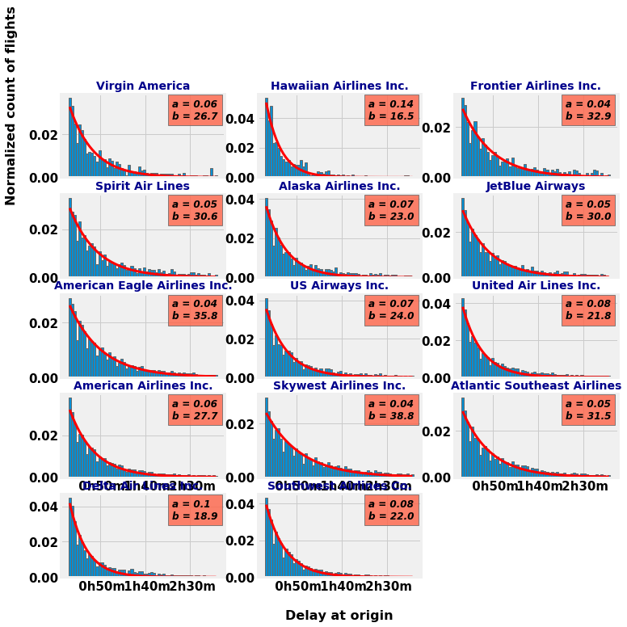


This figure shows the normalised distribution of delays that is modelised with an exponential distribution $ f(x) = a \, \mathrm{exp} (-x/b)$. The $a$ et $b$ parameters obtained to describe each airline are given in the upper right corner of each panel. Note that the normalisation of the distribution implies that $\int f(x) \, dx \sim 1$. Here, we do not have a strict equality since the normalisation applies the histograms but not to the model function. However, this relation entails that the $a$ et $b$ coefficients will be correlated with $a \propto 1/b$ and hence, only one of these two values is necessary to describe the distributions. Finally, according to the value of either $a$ or $b$, it is possible to establish a ranking of the companies: the low values of $a$ will correspond to airlines with a large proportion of important delays and, on the contrary, airlines that shine from their punctuality will admit hight $a$ values:


```python
mpl.rcParams.update(mpl.rcParamsDefault)
sns.set_context('paper')
import matplotlib.patches as patches

fig = plt.figure(1, figsize=(11,5))
y_shift = [0 for _ in range(14)]
y_shift[3] = 0.5/1000
y_shift[12] = 2.5/1000
y_shift[11] = -0.5/1000
y_shift[8] = -2.5/1000
y_shift[5] = 1/1000
x_val = [s[1] for s in points]
y_val = [s[0] for s in points]

gs=GridSpec(2,7)
#_______________________________
# 1/ Plot overview (left panel)
ax1=fig.add_subplot(gs[1,0:2]) 
plt.scatter(x=x_val, y=y_val, marker = 's', edgecolor='black', linewidth = '1')
#__________________________________
# Company label: Hawaiian airlines
i= 1
ax1.annotate(label_company[i], xy=(x_val[i]+1.5, y_val[i]+y_shift[i]),
             xycoords='data', fontsize = 10)
plt.xlabel("$b$ parameter", fontsize=16, labelpad=20)
plt.ylabel("$a$ parameter", fontsize=16, labelpad=20)
#__________________________________
# Company label: Hawaiian airlines
i= 12
ax1.annotate(label_company[i], xy=(x_val[i]+1.5, y_val[i]+y_shift[i]),
             xycoords='data', fontsize = 10)
plt.xlabel("$b$ parameter", fontsize=16, labelpad=20)
plt.ylabel("$a$ parameter", fontsize=16, labelpad=20)
#____________
# Main Title
ax1.text(.5,1.5,'Characterizing delays \n among companies', fontsize=16,
        bbox={'facecolor':'midnightblue', 'pad':5}, color='w',
        horizontalalignment='center',
        transform=ax1.transAxes)
#________________________
# plot border parameters
for k in ['top', 'bottom', 'right', 'left']:
    ax1.spines[k].set_visible(True)
    ax1.spines[k].set_linewidth(0.5)
    ax1.spines[k].set_color('k')
#____________________
# Create a Rectangle 
rect = patches.Rectangle((21,0.025), 19, 0.07, linewidth=2,
                         edgecolor='r', linestyle=':', facecolor='none')
ax1.add_patch(rect)
#_______________________________________________
# 2/ Zoom on the bulk of carriers (right panel)
ax2=fig.add_subplot(gs[0:2,2:])
plt.scatter(x=x_val, y=y_val, marker = 's', edgecolor='black', linewidth = '1')
plt.setp(ax1.get_xticklabels(), fontsize=12)
plt.setp(ax1.get_yticklabels(), fontsize=12)
ax2.set_xlim(21,45)
ax2.set_ylim(0.025,0.095)
#________________
# Company labels
for i in range(len(abbr_companies)):
    ax2.annotate(label_company[i], xy=(x_val[i]+0.5, y_val[i]+y_shift[i]),
                 xycoords='data', fontsize = 10)
#____________________________
# Increasing delay direction
ax2.arrow(30, 0.09, 8, -0.03, head_width=0.005,
          shape = 'full', head_length=2, fc='k', ec='k')
ax2.annotate('increasing \n  delays', fontsize= 20, color = 'r',
          xy=(35, 0.075), xycoords='data')
#________________________________
# position and size of the ticks
plt.tick_params(labelleft=False, labelright=True)
plt.setp(ax2.get_xticklabels(), fontsize=14)
plt.setp(ax2.get_yticklabels(), fontsize=14)
#________________________
# plot border parameters
for k in ['top', 'bottom', 'right', 'left']:
    ax2.spines[k].set_visible(True)
    ax2.spines[k].set_linewidth(0.5)
    ax2.spines[k].set_color('k')    
#________________________________
# Connection between the 2 plots
xy2 = (40, 0.09) ; xy1 = (21, 0.095)
con = ConnectionPatch(xyA=xy1, xyB=xy2, coordsA="data", coordsB="data",
                      axesA=ax2, axesB=ax1,
                      linestyle=':', linewidth = 2, color="red")
ax2.add_artist(con)
xy2 = (40, 0.025) ; xy1 = (21, 0.025)
con = ConnectionPatch(xyA=xy1, xyB=xy2, coordsA="data", coordsB="data",
                      axesA=ax2, axesB=ax1,
                      linestyle=':', linewidth = 2, color="red")
ax2.add_artist(con)
plt.xlabel("$b$ parameter", fontsize=16, labelpad=20)
#--------------------------------
plt.show()
```


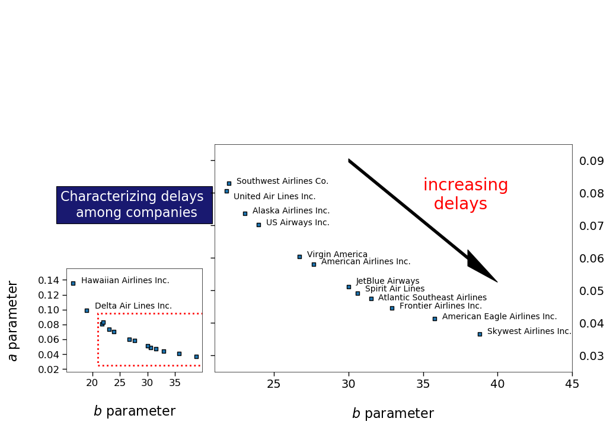


The left panel of this figure gives an overview of the $a$ and $b$ coefficients of the 14 airlines showing that *Hawaiian Airlines* 
and *Delta Airlines* occupy the first two places. The right panel zooms on 12 other airlines. We can see that *SouthWest Airlines*, which represent $\sim$20% of the total number of flights is well ranked and occupy the third position. According to this ranking, *SkyWest Airlines* is the worst carrier.

___
## 2.2 Relation between delay and arrival/departure <a name="2.2"></a>

In the previous section, all the discussion was done on departure delays. However, these delays differ somewhat from the delays recorded at arrival:


```python
mpl.rcParams.update(mpl.rcParamsDefault)
mpl.rcParams['hatch.linewidth'] = 2.0  

fig = plt.figure(1, figsize=(11,6))
ax = sns.barplot(x="DEPARTURE_DELAY", y="AIRLINE", data=df, color="lightskyblue", ci=None)
ax = sns.barplot(x="ARRIVAL_DELAY", y="AIRLINE", data=df, color="r", hatch = '///',
                 alpha = 0.0, ci=None)
labels = [abbr_companies[item.get_text()] for item in ax.get_yticklabels()]
ax.set_yticklabels(labels)
ax.yaxis.label.set_visible(False)
plt.xlabel('Mean delay [min] (@departure: blue, @arrival: hatch lines)',
           fontsize=14, weight = 'bold', labelpad=10);
```


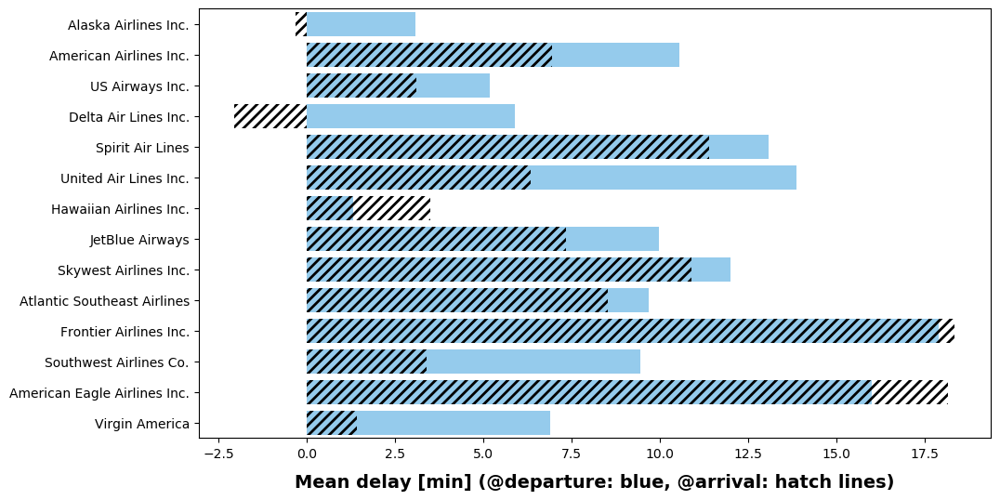


On this figure, we can see that delays at arrival are generally lower than at departure. This indicates that airlines adjust their flight speed in order to reduce the delays at arrival. In following section, we will just consider the delays at departure but one has to keep in mind that this can differ from arrival delays.

___
## 2.3. Relation between delay and the origin airport <a name="2.3"></a>

We will now determine if there is a correlation between the delays recorded and the airport of origin. Let's recall that in the dataset, the number of airports considered is: 


```python
print("Number of airports: {}".format(len(df['ORIGIN_AIRPORT'].unique())))
```

    Number of airports: 312


### 2.3.1 Geographical area covered by airlines <a name="2.3.1"></a>

A quick look at the number of destination airports for each airline:


```python
origin_nb = dict()
for carrier in abbr_companies.keys():
    liste_origin_airport = df[df['AIRLINE'] == carrier]['ORIGIN_AIRPORT'].unique()
    origin_nb[carrier] = len(liste_origin_airport)
```


```python
test_df = pd.DataFrame.from_dict(origin_nb, orient='index')
test_df.rename(columns = {0:'count'}, inplace = True)
ax = test_df.plot(kind='bar', figsize = (8,3))
labels = [abbr_companies[item.get_text()] for item in ax.get_xticklabels()]
ax.set_xticklabels(labels)
plt.ylabel('Number of airports visited', fontsize=14, weight = 'bold', labelpad=12)
plt.setp(ax.get_xticklabels(), fontsize=11, ha = 'right', rotation = 80)
ax.legend().set_visible(False)
plt.show()
```


```python
temp = pd.read_csv('./input/airports.csv')
identify_airport = temp.set_index('IATA_CODE')['CITY'].to_dict()
latitude_airport = temp.set_index('IATA_CODE')['LATITUDE'].to_dict()
longitude_airport = temp.set_index('IATA_CODE')['LONGITUDE'].to_dict()
```


```python
def make_map(df, carrier, long_min, long_max, lat_min, lat_max):
    fig=plt.figure(figsize=(7,3))
    ax=fig.add_axes([0.,0.,1.,1.])
    m = Basemap(resolution='i',llcrnrlon=long_min, urcrnrlon=long_max,
                  llcrnrlat=lat_min, urcrnrlat=lat_max, lat_0=0, lon_0=0,)
    df2 = df[df['AIRLINE'] == carrier]
    count_trajectories = df2.groupby(['ORIGIN_AIRPORT', 'DESTINATION_AIRPORT']).size()
    count_trajectories.sort_values(inplace = True)
    
    for (origin, dest), s in count_trajectories.iteritems():
        nylat,   nylon = latitude_airport[origin], longitude_airport[origin]
        m.plot(nylon, nylat, marker='o', markersize = 10, markeredgewidth = 1,
                   color = 'seagreen', markeredgecolor='k')

    for (origin, dest), s in count_trajectories.iteritems():
        nylat,   nylon = latitude_airport[origin], longitude_airport[origin]
        lonlat, lonlon = latitude_airport[dest], longitude_airport[dest]
        if pd.isnull(nylat) or pd.isnull(nylon) or \
                pd.isnull(lonlat) or pd.isnull(lonlon): continue
        if s < 100:
            m.drawgreatcircle(nylon, nylat, lonlon, lonlat, linewidth=0.5, color='b',
                             label = '< 100')
        elif s < 200:
            m.drawgreatcircle(nylon, nylat, lonlon, lonlat, linewidth=2, color='r',
                             label = '100 <.< 200')
        else:
            m.drawgreatcircle(nylon, nylat, lonlon, lonlat, linewidth=2, color='gold',
                              label = '> 200')    
    #_____________________________________________
    # remove duplicate labels and set their order
    handles, labels = plt.gca().get_legend_handles_labels()
    by_label = OrderedDict(zip(labels, handles))
    key_order = ('< 100', '100 <.< 200', '> 200')                
    new_label = OrderedDict()
    for key in key_order:
        if key not in by_label.keys(): continue
        new_label[key] = by_label[key]
    plt.legend(new_label.values(), new_label.keys(), loc = 'best', prop= {'size':8},
               title='flights per month', facecolor = 'palegreen', 
               shadow = True, frameon = True, framealpha = 1)    
    m.drawcoastlines()
    m.fillcontinents()
    ax.set_title('{} flights'.format(abbr_companies[carrier]))
```


```python
coord = dict()
coord['AA'] = [-165, -60, 10, 55]
coord['AS'] = [-182, -63, 10, 75]
coord['HA'] = [-180, -65, 10, 52]
for carrier in ['AA', 'AS', 'HA']: 
    make_map(df, carrier, *coord[carrier])
```


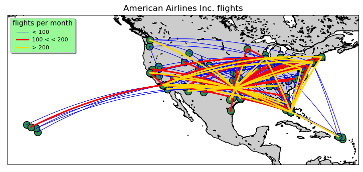


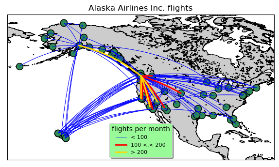


___
### 2.3.2 How the origin airport impact delays <a name="2.3.2"></a>

In this section, we will have a look at the variations of the delays with respect to the origin airport and for every airline. The first step thus consists in determining the mean delays per airport:


```python
airport_mean_delays = pd.DataFrame(pd.Series(df['ORIGIN_AIRPORT'].unique()))
airport_mean_delays.set_index(0, drop = True, inplace = True)

for carrier in abbr_companies.keys():
    df1 = df[df['AIRLINE'] == carrier]
    test = df1['DEPARTURE_DELAY'].groupby(df['ORIGIN_AIRPORT']).apply(get_stats).unstack()
    airport_mean_delays[carrier] = test.loc[:, 'mean'] 
```

Since the number of airports is quite large, a graph showing all the information at once would be a bit messy, since it would represent around 4400 values (i.e. 312 airports $\times$ 14 airlines). Hence, we just represent a subset of the data:


```python
sns.set(context="paper")
fig = plt.figure(1, figsize=(8,8))

ax = fig.add_subplot(1,2,1)
subset = airport_mean_delays.iloc[:50,:].rename(columns = abbr_companies)
subset = subset.rename(index = identify_airport)
mask = subset.isnull()
sns.heatmap(subset, linewidths=0.01, cmap="Accent", mask=mask, vmin = 0, vmax = 35)
plt.setp(ax.get_xticklabels(), fontsize=10, rotation = 85) ;
ax.yaxis.label.set_visible(False)

ax = fig.add_subplot(1,2,2)    
subset = airport_mean_delays.iloc[50:100,:].rename(columns = abbr_companies)
subset = subset.rename(index = identify_airport)
fig.text(0.5, 1.02, "Delays: impact of the origin airport", ha='center', fontsize = 18)
mask = subset.isnull()
sns.heatmap(subset, linewidths=0.01, cmap="Accent", mask=mask, vmin = 0, vmax = 35)
plt.setp(ax.get_xticklabels(), fontsize=10, rotation = 85) ;
ax.yaxis.label.set_visible(False)

plt.tight_layout()
```


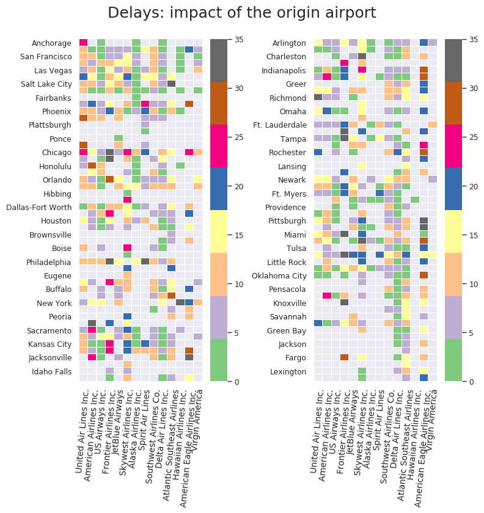


This figure allows to draw some conclusions. First, by looking at the data associated with the different airlines, we find the behavior we previously observed: for example, if we consider the right panel, it will be seen that the column associated with  *American Eagle Airlines* mostly reports large delays, while the column associated with *Delta Airlines* is mainly associated  with delays of less than 5 minutes. If we now look at the airports of origin, we will see that some airports favor late departures: see e.g. Denver, Chicago or New York. Conversely, other airports will mainly know on time departures such as Portland or Oakland.

Finally, we can deduce from these observations that **there is a high variability in average delays, both between the different airports but also between the different airlines. This is important because it implies that in order to accurately model the delays, it will be necessary to adopt a model that is specific to the company and the origin airport**. 

### 2.3.3 Flights Route with usual delays <a name="2.3.3"></a>

In the previous section, it has been seen that there is variability in delays when considering the different airlines and the different airports of origin. We are now going to add a level of granularity by focusing not just on the original airports but on flights: origin $\to$ destination. The objective here is to see if some flights are systematically delayed or if, on the contrary, there are flights that would always be on time.

In the following, we will consider the case of a single airline. All the flights from A $\to$ B carried out by this company are listed and for each of them, we create the list of delays that have been recorded:


```python
#_________________________________________________________________
# We select the company and create a subset of the main dataframe
carrier = 'AA'
df1 = df[df['AIRLINE']==carrier][['ORIGIN_AIRPORT','DESTINATION_AIRPORT','DEPARTURE_DELAY']]
#___________________________________________________________
# I collect the routes and list the delays for each of them
trajet = dict()
for ind, col in df1.iterrows():
    if pd.isnull(col['DEPARTURE_DELAY']): continue
    route = str(col['ORIGIN_AIRPORT'])+'-'+str(col['DESTINATION_AIRPORT'])
    if route in trajet.keys():
        trajet[route].append(col['DEPARTURE_DELAY'])
    else:
        trajet[route] = [col['DEPARTURE_DELAY']]
#____________________________________________________________________        
# I transpose the dictionary in a list to sort the routes by origins        
liste_trajet = []
for key, value in trajet.items():
    liste_trajet.append([key, value])
liste_trajet.sort()
```

We then calculate the average delay on the various paths A $\to$ B, as well as the standard deviation and once done, a graphical representation is shown (for a sample of the flights):


```python
mean_val = [] ; std_val = [] ; x_label = []

i = 0
for route, liste_retards in liste_trajet:
    #_____________________________________________
    # I set the labels as the airport from origin
    index = route.split('-')[0]
    x_label.append(identify_airport[index])
    #______________________________________________________________________________
    # I put a threshold on delays to prevent that high values take too much weight
    trajet2 = [min(90, s) for s in liste_retards]
    #________________________________________
    # I compute mean and standard deviations
    mean_val.append(scipy.mean(trajet2))
    std_val.append(scipy.std(trajet2))
    i += 1
#________________
# Plot the graph
fig, ax = plt.subplots(figsize=(10,4))
std_min = [ min(15 + mean_val[i], s) for i,s in enumerate(std_val)] 
ax.errorbar(list(range(i)), mean_val, yerr = [std_min, std_val], fmt='o') 
ax.set_title('Mean route delays for "{}"'.format(abbr_companies[carrier]),
             fontsize=14, weight = 'bold')
plt.ylabel('Mean delay at origin (minutes)', fontsize=14, weight = 'bold', labelpad=12)
#___________________________________________________
# I define the x,y range and positions of the ticks
imin, imax = 145, 230
plt.xlim(imin, imax) ; plt.ylim(-20, 45)
liste_ticks = [imin]
for j in range(imin+1,imax):
    if x_label[j] == x_label[j-1]: continue
    liste_ticks.append(j)
#_____________________________
# and set the tick parameters  
ax.set_xticks(liste_ticks)
ax.set_xticklabels([x_label[int(x)] for x in ax.get_xticks()], rotation = 90, fontsize = 8)
plt.setp(ax.get_yticklabels(), fontsize=12, rotation = 0)
ax.tick_params(axis='y', which='major', pad=15)

plt.show()
```


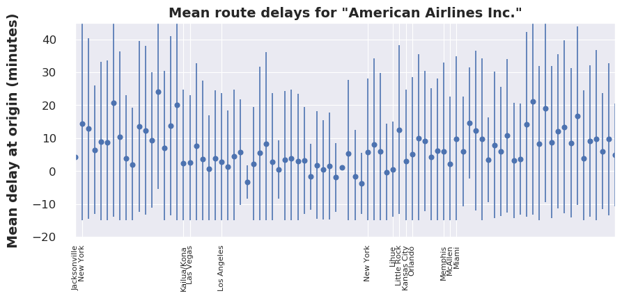


This figure gives the average delays for *American Airlines*, according to the city of origin and the destination (note that on the abscissa axis, only the origin is indicated for the sake of clarity). The error bars associated with the different paths correspond to the standard deviations.
In this example, it can be seen that for a given airport of origin, delays will fluctuate depending on the destination. We see, for example, that here the greatest variations are obtained for New York or Miami where the initial average delays vary between 0 and $\sim$20 minutes.

## 2.4 Relation between delay and departure time <a name = "2.4"></a>

In this section, we look at the way delays vary with time. Considering the case of a specific airline and airport, delays can be easily represented by day and time


```python
# pd.plotting.register_matplotlib_converters()
```


```python
class Figure_style():
    #_________________________________________________________________
    def __init__(self, size_x = 11, size_y = 5, nrows = 1, ncols = 1):
        sns.set_style("white")
        sns.set_context("notebook", font_scale=1.2, rc={"lines.linewidth": 2.5})
        self.fig, axs = plt.subplots(nrows = nrows, ncols = ncols, figsize=(size_x,size_y,))
        #________________________________
        # convert self.axs to 2D array
        if nrows == 1 and ncols == 1:
            self.axs = np.reshape(axs, (1, -1))
        elif nrows == 1:
            self.axs = np.reshape(axs, (1, -1))
        elif ncols == 1:
            self.axs = np.reshape(axs, (-1, 1))
    #_____________________________
    def pos_update(self, ix, iy):
        self.ix, self.iy = ix, iy
    #_______________
    def style(self):
        self.axs[self.ix, self.iy].spines['right'].set_visible(False)
        self.axs[self.ix, self.iy].spines['top'].set_visible(False)
        self.axs[self.ix, self.iy].yaxis.grid(color='lightgray', linestyle=':')
        self.axs[self.ix, self.iy].xaxis.grid(color='lightgray', linestyle=':')
        self.axs[self.ix, self.iy].tick_params(axis='both', which='major',
                                               labelsize=10, size = 5)
    #________________________________________
    def draw_legend(self, location='upper right'):
        legend = self.axs[self.ix, self.iy].legend(loc = location, shadow=True,
                                        facecolor = 'g', frameon = True)
        legend.get_frame().set_facecolor('whitesmoke')
    #_________________________________________________________________________________
    def cust_plot(self, x, y, color='b', linestyle='-', linewidth=1, marker=None, label=''):
        if marker:
            markerfacecolor, marker, markersize = marker[:]
            self.axs[self.ix, self.iy].plot(x, y, color = color, linestyle = linestyle,
                                linewidth = linewidth, marker = marker, label = label,
                                markerfacecolor = markerfacecolor, markersize = markersize)
        else:
            self.axs[self.ix, self.iy].plot(x, y, color = color, linestyle = linestyle,
                                        linewidth = linewidth, label=label)
        self.fig.autofmt_xdate()
    #________________________________________________________________________
    def cust_plot_date(self, x, y, color='lightblue', linestyle='-',
                       linewidth=1, markeredge=False, label=''):
        markeredgewidth = 1 if markeredge else 0
        self.axs[self.ix, self.iy].plot_date(x, y, color='lightblue', markeredgecolor='grey',
                                  markeredgewidth = markeredgewidth, label=label)
    #________________________________________________________________________
    def cust_scatter(self, x, y, color = 'lightblue', markeredge = False, label=''):
        markeredgewidth = 1 if markeredge else 0
        self.axs[self.ix, self.iy].scatter(x, y, color=color,  edgecolor='grey',
                                  linewidths = markeredgewidth, label=label)    
    #___________________________________________
    def set_xlabel(self, label, fontsize = 14):
        self.axs[self.ix, self.iy].set_xlabel(label, fontsize = fontsize)
    #___________________________________________
    def set_ylabel(self, label, fontsize = 14):
        self.axs[self.ix, self.iy].set_ylabel(label, fontsize = fontsize)
    #____________________________________
    def set_xlim(self, lim_inf, lim_sup):
        self.axs[self.ix, self.iy].set_xlim([lim_inf, lim_sup])
    #____________________________________
    def set_ylim(self, lim_inf, lim_sup):
        self.axs[self.ix, self.iy].set_ylim([lim_inf, lim_sup])           
```


```python
carrier = 'WN'
id_airport = 4
liste_origin_airport = df[df['AIRLINE'] == carrier]['ORIGIN_AIRPORT'].unique()
df2 = df[(df['AIRLINE'] == carrier) & (df['ARRIVAL_DELAY'] > 0)
         & (df['ORIGIN_AIRPORT'] == liste_origin_airport[id_airport])]
df2.sort_values('SCHEDULED_DEPARTURE', inplace = True)
```


```python
fig1 = Figure_style(11, 5, 1, 1)
fig1.pos_update(0, 0)
fig1.cust_plot(df2['SCHEDULED_DEPARTURE'], df2['DEPARTURE_DELAY'], linestyle='-')
fig1.style() 
fig1.set_ylabel('Delay (minutes)', fontsize = 14)
fig1.set_xlabel('Departure date', fontsize = 14)
date_1 = datetime.datetime(2015,1,1)
date_2 = datetime.datetime(2015,1,15)
fig1.set_xlim(date_1, date_2)
fig1.set_ylim(-15, 260)
```


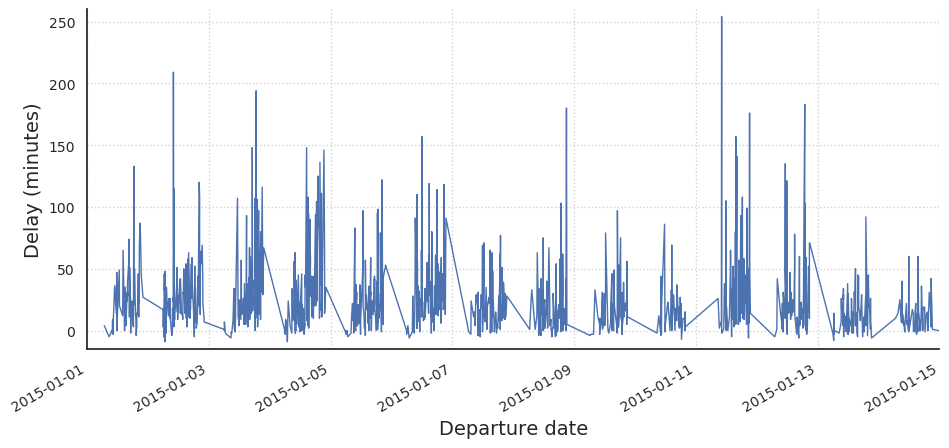


This figure shows the existence of cycles, both in the frequency of the delays but also in their magnitude. In fact, intuitively, it seems quite logical to observe such cycles since they will be a consequence of the day-night alternation and the fact that the airport activity will be greatly reduced (if not inexistent) during the night. **This suggests that an important  variable in the modeling of delays will be take-off time**. To check this hypothesis, let's look at the behavior of the mean delay as a function of departure time, aggregating the data of the current month:


```python
#_______________________________
def func2(x, a, b, c):
    return a * x**2 +  b*x + c
#_______________________________
df2['heure_depart'] =  df2['SCHEDULED_DEPARTURE'].apply(lambda x:x.time())
test2 = df2['DEPARTURE_DELAY'].groupby(df2['heure_depart']).apply(get_stats).unstack()
fct = lambda x:x.hour*3600+x.minute*60+x.second
x_val = np.array([fct(s) for s in test2.index]) 
y_val = test2['mean']
popt, pcov = curve_fit(func2, x_val, y_val, p0 = [1, 2, 3])
test2['fit'] = pd.Series(func2(x_val, *popt), index = test2.index)
```

which visually gives:


```python
import datetime
fig1 = Figure_style(8, 4, 1, 1)
fig1.pos_update(0, 0)
#fig1.cust_plot_date(df2['heure_depart'], df2['DEPARTURE_DELAY'],
#                    markeredge=False, label='initial data points')
fig1.cust_plot(test2.index, test2['mean'], linestyle='--', linewidth=2, label='mean')
fig1.cust_plot(test2.index, test2['fit'], color='r', linestyle='-', linewidth=3, label='fit')
fig1.style() ; fig1.draw_legend('upper left')
fig1.set_ylabel('Delay (minutes)', fontsize = 14)
fig1.set_xlabel('Departure time', fontsize = 14)
fig1.set_ylim(-15, 210)
```


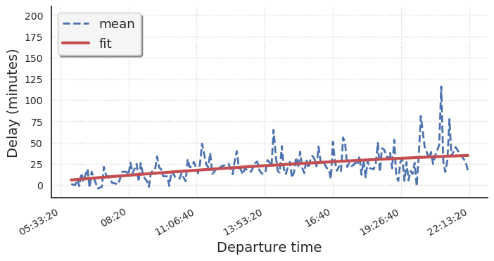


Here, we can see that the average delay tends to increase with the departure time of day: flights leave on time in the morning  and the delay grows almost monotonously up to 30 minutes at the end of the day. In fact, this behavior is quite general and looking at other aiports or companies, we would find similar trends.

___
# 3. MODELLING TO PREDICT FLIGHT DELAY <a name="3"></a>

The previsous sections dealt with an exploration of the dataset. Here, we start with the modeling of flight delays.
In this section, our goal is to create a model that uses a window of 3 weeks to predict the delays of the following week.
Hence, let's use the data of January with the aim of predicting the delays of the epoch $23^{th}-31^{th}$ of Januaray


```python
df_train = df[df['SCHEDULED_DEPARTURE'].apply(lambda x:x.date()) < datetime.date(2015, 1, 23)]
df_test  = df[df['SCHEDULED_DEPARTURE'].apply(lambda x:x.date()) > datetime.date(2015, 1, 23)]
df = df_train
```

___
## 3.1 Model no.1: one airline, one airport <a name="3.1"></a>

We first model the delays by considering separately the different airlines and by splitting the data according to the different home airports. This first model can be seen as a *toy-model*  that enables to identify problems that may arise at the  production stage. When treating the whole dataset,  the number of fits will be large. Hence we have to be sure that the automation of the whole process is robust enough to insure the quality of the fits.


### 3.1.1 Pitfalls <a name="3.1.1"></a><br>


**a) Unsufficient statistics**

First of all, we consider the *American Airlines* flights and make a census of the number of flights that left each airport:


```python
carrier = 'AA'
check_airports = df[(df['AIRLINE'] == carrier)]['DEPARTURE_DELAY'].groupby(
                         df['ORIGIN_AIRPORT']).apply(get_stats).unstack()
check_airports.sort_values('count', ascending = False, inplace = True)
check_airports[-5:]
```


<div>
<style scoped>
    .dataframe tbody tr th:only-of-type {
        vertical-align: middle;
    }

    .dataframe tbody tr th {
        vertical-align: top;
    }

    .dataframe thead th {
        text-align: right;
    }
</style>
<table border="1" class="dataframe">
  <thead>
    <tr style="text-align: right;">
      <th></th>
      <th>min</th>
      <th>max</th>
      <th>count</th>
      <th>mean</th>
    </tr>
    <tr>
      <th>ORIGIN_AIRPORT</th>
      <th></th>
      <th></th>
      <th></th>
      <th></th>
    </tr>
  </thead>
  <tbody>
    <tr>
      <th>JAC</th>
      <td>-19.0</td>
      <td>47.0</td>
      <td>25.0</td>
      <td>-3.640000</td>
    </tr>
    <tr>
      <th>GUC</th>
      <td>-24.0</td>
      <td>199.0</td>
      <td>22.0</td>
      <td>13.227273</td>
    </tr>
    <tr>
      <th>SDF</th>
      <td>-8.0</td>
      <td>55.0</td>
      <td>19.0</td>
      <td>8.421053</td>
    </tr>
    <tr>
      <th>LIT</th>
      <td>-5.0</td>
      <td>74.0</td>
      <td>9.0</td>
      <td>12.555556</td>
    </tr>
    <tr>
      <th>MTJ</th>
      <td>-2.0</td>
      <td>51.0</td>
      <td>3.0</td>
      <td>26.000000</td>
    </tr>
  </tbody>
</table>
</div>


Looking at this list, we can see that the less visited aiports only have a few flights in a month.
Thus, in the least favorable case, it is impossible to perform a regression.

**b) Extreme delays**

Another pitfall to avoid is that of "accidental" delays: a particular attention should be paid to extreme delays. Indeed, during the exploration, it was seen that occasionally, delays of several hours (even tens of hours) could be recorded. This type of delay is however marginal (a few %) and the cause of these delays is probably linked to unpredictable events (weather, breakdown, accident, ...). On the other hand, taking into account a delay of this type will likely introduce a bias in the analysis. Moreover, the weight taken by large values will be significant if we have a small statistics.

In order to illustrate this, let's first define a function that calculates the mean flights delay per airline and per airport: 


```python
def get_flight_delays(df, carrier, id_airport, extrem_values = False):
    df2 = df[(df['AIRLINE'] == carrier) & (df['ORIGIN_AIRPORT'] == id_airport)]
    #_______________________________________
    # remove extreme values before fitting
    if extrem_values:
        df2['DEPARTURE_DELAY'] = df2['DEPARTURE_DELAY'].apply(lambda x:x if x < 60 else np.nan)
        df2.dropna(how = 'any')
    #__________________________________
    # Conversion: date + heure -> heure
    df2.sort_values('SCHEDULED_DEPARTURE', inplace = True)
    df2['heure_depart'] =  df2['SCHEDULED_DEPARTURE'].apply(lambda x:x.time())
    #___________________________________________________________________
    # regroupement des vols par heure de départ et calcul de la moyenne
    test2 = df2['DEPARTURE_DELAY'].groupby(df2['heure_depart']).apply(get_stats).unstack()
    test2.reset_index(inplace=True)
    #___________________________________
    # conversion de l'heure en secondes
    fct = lambda x:x.hour*3600+x.minute*60+x.second
    test2.reset_index(inplace=True)
    test2['heure_depart_min'] = test2['heure_depart'].apply(fct)
    return test2
```


and then a function that performs a linear regression on these values:


```python
def linear_regression(test2):
    test = test2[['mean', 'heure_depart_min']].dropna(how='any', axis = 0)
    X = np.array(test['heure_depart_min'])
    Y = np.array(test['mean'])
    X = X.reshape(len(X),1)
    Y = Y.reshape(len(Y),1)
    regr = linear_model.LinearRegression()
    regr.fit(X, Y)
    result = regr.predict(X)
    return X, Y, result
```

We define two scenarios here. In the first case, we take all the initial values and in the second case, we eliminate all delays greater than 1h before calculating the average delay. The comparison of the two cases is quite explicit:


```python
id_airport = 'PHL'
df2 = df[(df['AIRLINE'] == carrier) & (df['ORIGIN_AIRPORT'] == id_airport)]
df2['heure_depart'] =  df2['SCHEDULED_DEPARTURE'].apply(lambda x:x.time())
df2['heure_depart'] = df2['heure_depart'].apply(lambda x:x.hour*3600+x.minute*60+x.second)
#___________________
# first case
test2 = get_flight_delays(df, carrier, id_airport, False)
X1, Y1, result2 = linear_regression(test2)
#___________________
# second case
test3 = get_flight_delays(df, carrier, id_airport, True)
X2, Y2, result3 = linear_regression(test3)
```


```python
fig1 = Figure_style(8, 4, 1, 1)
fig1.pos_update(0, 0)
fig1.cust_scatter(df2['heure_depart'], df2['DEPARTURE_DELAY'], markeredge = True)
fig1.cust_plot(X1, Y1, color = 'b', linestyle = ':', linewidth = 2, marker = ('b','s', 10))
fig1.cust_plot(X2, Y2, color = 'g', linestyle = ':', linewidth = 2, marker = ('g','X', 12))
fig1.cust_plot(X1, result2, color = 'b', linewidth = 3)
fig1.cust_plot(X2, result3, color = 'g', linewidth = 3)
fig1.style()
fig1.set_ylabel('Delay (minutes)', fontsize = 14)
fig1.set_xlabel('Departure time', fontsize = 14)
#____________________________________
# convert and set the x ticks labels
fct_convert = lambda x: (int(x/3600) , int(divmod(x,3600)[1]/60))
fig1.axs[fig1.ix, fig1.iy].set_xticklabels(['{:2.0f}h{:2.0f}m'.format(*fct_convert(x))
                                            for x in fig1.axs[fig1.ix, fig1.iy].get_xticks()]);
```


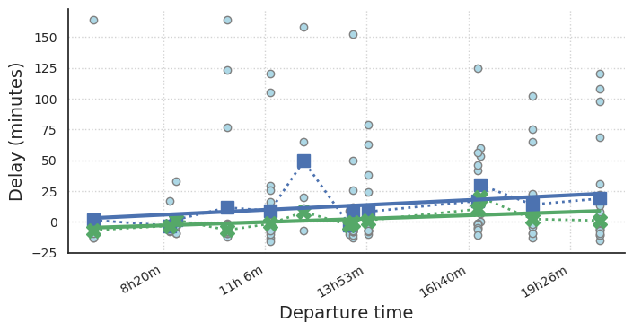


First of all, in this figure, the points corresponding to the individual flights are represented by the points in gray.
The mean of these points gives the mean delays and the mean of the set of initial points corresponds to the blue squares. By removing extreme delays (> 1h), one obtains the average delays represented by the green crosses.
Thus, in the first case, the fit (solid blue curve) leads to a prediction which corresponds to an average delay of $\sim$ 10 minutes larger than the predicton obtained in the second case (green curve), and this, at any hour of the day.

In conclusion, we see in this example that the way in which we manage the extreme delays will have an important impact on the modeling. Note, however, that the current example corresponds to a *chosen case* where the impact of extreme delays is magnified by the limited number of flights. Presumably, the impact of such delays will be less pronounced in the majority of cases.

___
### 3.1.2 Polynomial degree: splitting the dataset <a name="3.1.2"></a>


In practice, rather than performing a simple linear regression, we can improve the model doing a fit with a polynomial of order $N$. Doing so, it is necessary to define the degree $N$ which is optimal to represent the data. When increasing the polynomial order, it is important ** to prevent over-fitting** and we do this by splitting the dataset in **test and training sets**. A problem that may arise with this procedure is that the model ends by *indirectly* learning the contents of the test set and is thus biased. To avoid this, the data can be re-separated into 3 sets: *train*, *test* and *validation*. An alternative to this technique, which is often more robust, is the so-called cross-validation method. This method consists of performing a first separation of the data in *training* and *test* sets. As always, learning is done on the training set, but to avoid over-learning, it is split into several pieces that are used alternately for training and testing.

Note that if the data set is small, the separation in test & training sets can introduce a bias in the estimation of the parameters. In practice, the *cross-validation* method avoids such bias. In fact, in the current model, we will encounter this type of problem. For example, we can consider an extreme case where, after separation, the training set would contain only hours $<$20h and the test set would have hours$>$ 20h. The model would then be unable to reproduce precisely this data, of which it would not have seen equivalent during the training. The cross-validation method avoids this bias because all the data are used successively to drive the model.

**a) Bias introduced by the separation of the data set**

In order to test the impact of data separation on model determination, we first define the class *fit_polynome*:


```python
class fit_polynome:

    def __init__(self, data):
        self.data = data[['mean', 'heure_depart_min']].dropna(how='any', axis = 0)

    def split(self, method):        
        self.method = method        
        self.X = np.array(self.data['heure_depart_min'])
        self.Y = np.array(self.data['mean'])
        self.X = self.X.reshape(len(self.X),1)
        self.Y = self.Y.reshape(len(self.Y),1)

        if method == 'all':
            self.X_train = self.X
            self.Y_train = self.Y
            self.X_test  = self.X
            self.Y_test  = self.Y                        
        elif method == 'split':            
            self.X_train, self.X_test, self.Y_train, self.Y_test = \
                train_test_split(self.X, self.Y, test_size=0.3)
    
    def train(self, pol_order):
        self.poly = PolynomialFeatures(degree = pol_order)
        self.regr = linear_model.LinearRegression()
        self.X_ = self.poly.fit_transform(self.X_train)
        self.regr.fit(self.X_, self.Y_train)
    
    def predict(self, X):
        self.X_ = self.poly.fit_transform(X)
        self.result = self.regr.predict(self.X_)
    
    def calc_score(self):        
        X_ = self.poly.fit_transform(self.X_test)
        result = self.regr.predict(X_)
        self.score = metrics.mean_squared_error(result, self.Y_test)
```

The *fit_polynome* class allows you to perform all operations related to a fit and to save the results. When calling the  **split()** method, the variable *method* defines how the initial data is separated:
- **method = 'all'**: all input data is used to train and then test the model
- **method = 'split'**: we use the *train_test_split()* method of sklearn to define test & training sets
 
Then, the other methods of the class have the following functions:
- **train (n)**: drives the data on the training set and makes a polynomial of order n
- **predict (X)**: calculates the Y points associated with the X input and for the previously driven model
- **calc_score ()**: calculates the model score in relation to the test set data

In order to illustrate the bias introduced by the selection of the test set, we proceed in the following way: I carry out several "train / test" separation of a data set and for each case, I fit polynomials of orders **n = 1, 2 and 3**, by calculating their respective scores. Then, we show that according to the choice of separation, **the best score can be obtained with any of the values of n**. In practice, it is enough to carry out a dozen models to obtain this result. Moreover, this bias is introduced by the choice of the separation "train / test" and results from the small size of the dataset to be modeled. In fact, in the following, we take as an example the case of the airline **American Airlines** (the second biggest airline) and the airport of id **1129804**, which is the airport with the most registered flights for that company. This is one of the least favorable scenarios for the emergence of this kind of bias, which, nevertheless, is present:


```python
fig = plt.figure(1, figsize=(10,4))

ax = ['_' for _ in range(4)]
ax[1]=fig.add_subplot(131) 
ax[2]=fig.add_subplot(132) 
ax[3]=fig.add_subplot(133) 

id_airport = 'BNA'
test2 = get_flight_delays(df, carrier, id_airport, True)

result = ['_' for _ in range(4)]
score = [10000 for _ in range(4)]
found = [False for _ in range(4)]
fit = fit_polynome(test2)

color = '.rgbyc'

inc = 0
while True:
    inc += 1
    fit.split('split')
    for i in range(1,4):
        fit.train(pol_order = i)
        fit.predict(fit.X)
        result[i] = fit.result
        fit.calc_score()
        score[i]  = fit.score

    [ind_min] = [j for j,val in enumerate(score) if min(score) == val]
    print("model no.{:<2}, min. pour n = {}, score = {:.1f}".format(inc, ind_min,score[ind_min]))
    
    if not found[ind_min]:            
        for i in range(1,4):
            ax[ind_min].plot(fit.X, result[i], color[i], linewidth = 4 if i == ind_min else 1)
        ax[ind_min].scatter(fit.X, fit.Y)                
        ax[ind_min].text(0.05, 0.95, 'MSE = {:.1f}, {:.1f}, {:.1f}'.format(*score[1:4]),
                         style='italic', transform=ax[ind_min].transAxes, fontsize = 8,
                         bbox={'facecolor':'tomato', 'alpha':0.8, 'pad':5})                
        found[ind_min] = True

    shift = 0.5
    plt.text(-1+shift, 1.05, "polynomial order:", color = 'k',
                transform=ax[2].transAxes, fontsize = 16, family='fantasy')
    plt.text(0+shift, 1.05, "n = 1", color = 'r', 
                transform=ax[2].transAxes, fontsize = 16, family='fantasy')
    plt.text(0.4+shift, 1.05, "n = 2", color = 'g', 
                transform=ax[2].transAxes, fontsize = 16, family='fantasy')
    plt.text(0.8+shift, 1.05, "n = 3", color = 'b',
                transform=ax[2].transAxes, fontsize = 16, family='fantasy')
   
    if inc == 40 or all(found[1:4]): break
```

    model no.1 , min. pour n = 1, score = 152.9
    model no.2 , min. pour n = 2, score = 144.4
    model no.3 , min. pour n = 3, score = 156.1


In this figure, the panels from left to right correspond to 3 separations of the data in train and test sets, for which the best models are obtained respectively with polynomials of order 1, 2 and 3. On each of these panels the 3 fits polynomials have been represented and the best model corresponds to the thick curve.

**b) Selection by cross-validation**

One of the advantages of the cross-validation method is that it avoids the bias that has just been put forward when choosing the polynomial degree. In order to use this method, we first define a new class that will be used later to perform the fits:


```python
class fit_polynome_cv:

    def __init__(self, data):
        self.data = data[['mean', 'heure_depart_min']].dropna(how='any', axis = 0)
        self.X = np.array(self.data['heure_depart_min'])
        self.Y = np.array(self.data['mean'])
        self.X = self.X.reshape(len(self.X),1)
        self.Y = self.Y.reshape(len(self.Y),1)

    def train(self, pol_order, nb_folds):
        self.poly = PolynomialFeatures(degree = pol_order)
        self.regr = linear_model.LinearRegression()
        self.X_ = self.poly.fit_transform(self.X)
        self.result = cross_val_predict(self.regr, self.X_, self.Y, cv = nb_folds)
    
    def calc_score(self, pol_order, nb_folds):
        self.poly = PolynomialFeatures(degree = pol_order)
        self.regr = linear_model.LinearRegression()
        self.X_ = self.poly.fit_transform(self.X)
        self.score = np.mean(cross_val_score(self.regr, self.X_, self.Y,
                                             cv = nb_folds, scoring = 'neg_mean_squared_error'))
```

This class has two methods:
- **train (n, nb_folds)**: defined 'nb_folds' training sets from the initial dataset and drives a 'n' order polynomial on each of these sets. This method returns as a result the Y predictions obtained for the different test sets.
- **calc_score (n, nb_folds)**: performs the same procedure as a *train* method except that this method calculates the fit score and not the predicted values ​​on the different test data.

By default, the *K-fold* method is used by sklearn *cross_val_predict ()* and *cross_val_score ()* methods. These methods are deterministic in the choice of the K folds, which implies that for a fixed K value, the results obtained using these methods will always be identical. As seen in the previous example, this was not the case when using the *train_test_split()* method. Thus, if we take the same dataset as in the previous example, the method of cross validation makes it possible to choose the best polynomial degree:


```python
#id_airport = 1129804 
nb_folds = 10
print('Max possible number of folds: {} \n'.format(test2.shape[0]-1))
fit2 = fit_polynome_cv(test2)
for i in range(1, 8):
    fit2.calc_score(i, nb_folds)
    print('n={} -> MSE = {}'.format(i, round(abs(fit2.score),3)))
```

    Max possible number of folds: 16 
    
    n=1 -> MSE = 130.629
    n=2 -> MSE = 151.79
    n=3 -> MSE = 159.456
    n=4 -> MSE = 162.631
    n=5 -> MSE = 166.966
    n=6 -> MSE = 173.08
    n=7 -> MSE = 181.361


```python
#import sklearn
#sorted(sklearn.metrics.SCORERS.keys())
```


    ['accuracy',
     'adjusted_mutual_info_score',
     'adjusted_rand_score',
     'average_precision',
     'balanced_accuracy',
     'completeness_score',
     'explained_variance',
     'f1',
     'f1_macro',
     'f1_micro',
     'f1_samples',
     'f1_weighted',
     'fowlkes_mallows_score',
     'homogeneity_score',
     'jaccard',
     'jaccard_macro',
     'jaccard_micro',
     'jaccard_samples',
     'jaccard_weighted',
     'max_error',
     'mutual_info_score',
     'neg_brier_score',
     'neg_log_loss',
     'neg_mean_absolute_error',
     'neg_mean_gamma_deviance',
     'neg_mean_poisson_deviance',
     'neg_mean_squared_error',
     'neg_mean_squared_log_error',
     'neg_median_absolute_error',
     'neg_root_mean_squared_error',
     'normalized_mutual_info_score',
     'precision',
     'precision_macro',
     'precision_micro',
     'precision_samples',
     'precision_weighted',
     'r2',
     'recall',
     'recall_macro',
     'recall_micro',
     'recall_samples',
     'recall_weighted',
     'roc_auc',
     'roc_auc_ovo',
     'roc_auc_ovo_weighted',
     'roc_auc_ovr',
     'roc_auc_ovr_weighted',
     'v_measure_score']


We can see that using this method gives us that the best model (ie the best generalized model) is obtained with a polynomial of order 2. At this stage of the procedure, the choice of the polynomial order has been validated and we can now use all the data in order to perform the fit:


```python
fit = fit_polynome(test2)
fit.split('all')
fit.train(pol_order = 2)
fit.predict(fit.X)
```

Thus, in the following figure, the juxtaposition of the K = 10 polynomial fits corresponding to the cross validation calculation leads to the blue curve. The polynomial fit corresponding to the final model corresponds to the red curve.


```python
fit2.train(pol_order = 2, nb_folds = nb_folds)
```


```python
fig1 = Figure_style(8, 4, 1, 1) ; fig1.pos_update(0, 0)
fig1.cust_scatter(fit2.X, fit2.Y, markeredge = True, label = 'initial data points')
fig1.cust_plot(fit.X,fit2.result,color=u'#1f77b4',linestyle='--',linewidth=2,label='CV output')
fig1.cust_plot(fit.X,fit.result,color=u'#ff7f0e',linewidth = 3,label='final fit')
fig1.style(); fig1.draw_legend('upper left')
fig1.set_ylabel('Delay (minutes)') ; fig1.set_xlabel('Departure time')
#____________________________________
# convert and set the x ticks labels
fct_convert = lambda x: (int(x/3600) , int(divmod(x,3600)[1]/60))
fig1.axs[fig1.ix, fig1.iy].set_xticklabels(['{:2.0f}h{:2.0f}m'.format(*fct_convert(x))
                                            for x in fig1.axs[fig1.ix, fig1.iy].get_xticks()]);
```


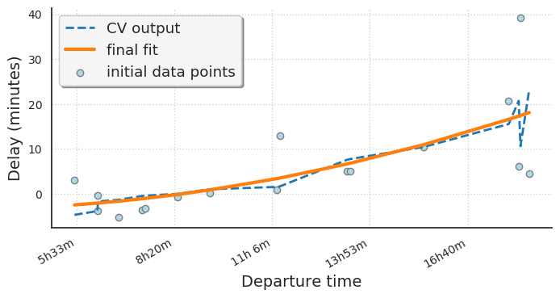


```python
score = metrics.mean_squared_error(fit.result, fit2.Y)
score
```


    56.86284771892097


### 3.1.3 Model test: prediction of end-January delays <a name="3.1.3"></a>

At this stage, the model was driven is tested on the training set which include the data of the first 3 weeks of January. We now look at the comparison of predictions and observations for the fourth week of January:


```python
test_data = get_flight_delays(df_test, carrier, id_airport, True)
test_data = test_data[['mean', 'heure_depart_min']].dropna(how='any', axis = 0)
X_test = np.array(test_data['heure_depart_min'])
Y_test = np.array(test_data['mean'])
X_test = X_test.reshape(len(X_test),1)
Y_test = Y_test.reshape(len(Y_test),1)
fit.predict(X_test)
```

and the MSE score of the model is:


```python
score = metrics.mean_squared_error(fit.result, Y_test)
score
```


    108.67130851608408


To get an idea of the meaning of such a value for the MSE, we can assume a constant error on each point of the dataset. In which case, at each point $ i $, we have:

\begin{eqnarray}
y_i - f(x_i) = cste = \sqrt{MSE}
\end{eqnarray}

thus giving the difference in minutes between the predicted delay and the actual delay. In this case, the difference between the model and the observations is thus typically:


```python
'Ecart = {:.2f} min'.format(np.sqrt(score))
```


    'Ecart = 10.42 min'


___
## 3.2 Model no.2: One airline, all airports <a name="3.2"></a>

In the previous section, the model only considered one airport. This procedure is potentially inefficient because it is likely that some of the observations can be extrapolated from an airport to another. Thus, it may be advantageous to make a single fit, which would take all the airports into account. In particular, this will allow to predict delays on airports for which the number of data is low with a better accuracy.


```python
def get_merged_delays(df, carrier):
    liste_airports = df[df['AIRLINE'] == carrier]['ORIGIN_AIRPORT'].unique()
    i = 0
    liste_columns = ['AIRPORT_ID', 'heure_depart_min', 'mean']
    for id_airport in liste_airports:
        test2 = get_flight_delays(df, carrier, id_airport, True)
        test2.loc[:, 'AIRPORT_ID'] = id_airport
        test2 = test2[liste_columns]
        test2.dropna(how = 'any', inplace = True)
        if i == 0:
            merged_df = test2.copy()
        else:
            merged_df = pd.concat([merged_df, test2], ignore_index = True)
        i += 1    
    return merged_df
```


```python
carrier = 'AA'
merged_df = get_merged_delays(df, carrier)
merged_df.shape
```


    (1831, 3)


```python
print(merged_df.head())
```

      AIRPORT_ID  heure_depart_min      mean
    0        LAX               300  2.842105
    1        LAX               600 -6.000000
    2        LAX              1200 -3.000000
    3        LAX              2100  2.000000
    4        LAX              3900 -0.880000


```python
print("Number of airport in merged_df: " , len(merged_df.AIRPORT_ID.unique()))
```

    Number of airport in merged_df:  81


In the *merged_df* dataframe, airports are referenced by an identifier given in the **ORIGIN_AIRPORT** variable.
The corresponding labels can't be used directly in a fit and we need to convert it using *one-hot-encoding* method:


```python
label_encoder = LabelEncoder()
integer_encoded = label_encoder.fit_transform(merged_df['AIRPORT_ID'])
#__________________________________________________________
# correspondance between the codes and tags of the airports
zipped = zip(integer_encoded, merged_df['AIRPORT_ID'])
label_airports = list(set(list(zipped)))
label_airports.sort(key = lambda x:x[0])
label_airports[:5]
```


    [(0, 'ABQ'), (1, 'ATL'), (2, 'AUS'), (3, 'BDL'), (4, 'BHM')]


Above, we have assigned a label to each airport. The correspondence between the label and the original identifier has been saved in the *label_airport* list. Now we proceed with the "One Hot Encoding" by creating a matrix where instead of the **ORIGIN_AIRPORT** variable that contained $M$ labels, we build a matrix with $M$ columns, filled of 0 and 1 depending on the correspondance with particular airports:


```python
onehot_encoder = OneHotEncoder(sparse=False)
integer_encoded = integer_encoded.reshape(len(integer_encoded), 1)
onehot_encoded = onehot_encoder.fit_transform(integer_encoded)
b = np.array(merged_df['heure_depart_min'])
b = b.reshape(len(b),1)
X = np.hstack((onehot_encoded, b))
Y = np.array(merged_df['mean'])
Y = Y.reshape(len(Y), 1)
print(X.shape, Y.shape)
```

    (1831, 82) (1831, 1)


___
### 3.2.1 Linear regression <a name="3.2.1"></a>

The matrices X and Y thus created can be used to perform a linear regression:


```python
lm = linear_model.LinearRegression()
model = lm.fit(X,Y)
predictions = lm.predict(X)
print("MSE =", metrics.mean_squared_error(predictions, Y))
```

    MSE = 53.74307365423859


Here, we calculated the MSE score of the fit. In practice, we can have a feeling of the quality of the fit by considering the number of predictions where the differences with real values is greater than 15 minutes:


```python
icount = 0
for i, val in enumerate(Y):
    if abs(val-predictions[i]) > 15: icount += 1
'{:.2f}%'.format(icount / len(predictions) * 100)
```


    '5.30%'


In practice, this model tends to underestimate the large delays, which can be seen in the following figure:


```python
tips = pd.DataFrame()
tips["prediction"] = pd.Series([float(s) for s in predictions]) 
tips["original_data"] = pd.Series([float(s) for s in Y]) 
sns.jointplot(x="original_data", y="prediction", data=tips, size = 6, ratio = 7,
              joint_kws={'line_kws':{'color':'limegreen'}}, kind='reg')
plt.xlabel('Mean delays (min)', fontsize = 15)
plt.ylabel('Predictions (min)', fontsize = 15)
plt.plot(list(range(-10,25)), list(range(-10,25)), linestyle = ':', color = 'r')
plt.show()
```


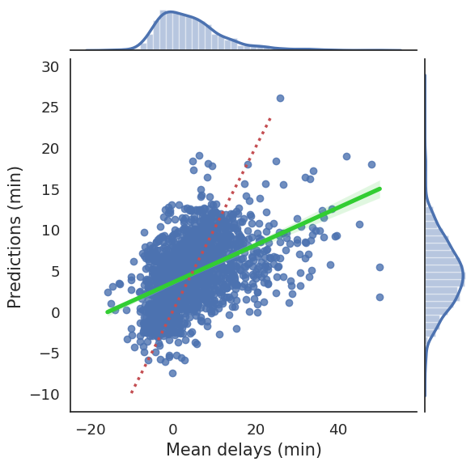


___
### 3.2.2 Polynomial regression <a name="3.2.2"></a>

We will now extend the previous fit by using a polynomial rather than a linear function:


```python
poly = PolynomialFeatures(degree = 2)
regr = linear_model.LinearRegression()
X_ = poly.fit_transform(X)
regr.fit(X_, Y)
```


    LinearRegression(copy_X=True, fit_intercept=True, n_jobs=None, normalize=False)


```python
result = regr.predict(X_)
print("MSE =", metrics.mean_squared_error(result, Y))
```

    MSE = 49.5025425362346


We can see that a polynomial fit improves slightly the MSE score. In practice, the percentage of values where the difference between predictions and real delays is greater than 15 minutes is:


```python
icount = 0
for i, val in enumerate(Y):
    if abs(val-result[i]) > 15: icount += 1
'{:.2f}%'.format(icount / len(result) * 100)
```


    '4.81%'


And as before, it can be seen that model tends to be worse in the case of large delays:


```python
tips = pd.DataFrame()
tips["prediction"] = pd.Series([float(s) for s in result]) 
tips["original_data"] = pd.Series([float(s) for s in Y]) 
sns.jointplot(x="original_data", y="prediction", data=tips, size = 6, ratio = 7,
              joint_kws={'line_kws':{'color':'limegreen'}}, kind='reg')
plt.xlabel('Mean delays (min)', fontsize = 15)
plt.ylabel('Predictions (min)', fontsize = 15)
plt.plot(list(range(-10,25)), list(range(-10,25)), linestyle = ':', color = 'r')
plt.show()
```


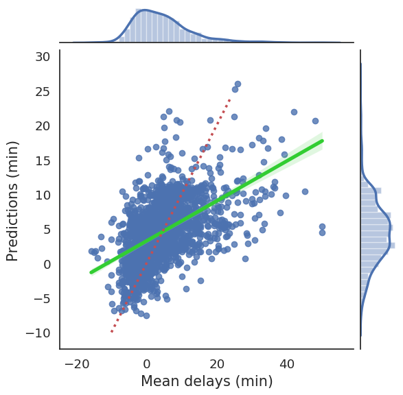


___
### 3.2.3 Setting the hyper-parameters <a name="3.2.3"></a>

Above, the two models were fit and tested on the training set. In practice, as mentioned above, there is a risk of overfitting by proceeding that way and the hyper-parameters of the model will be biased. Hence,  the model will not allow a good generalization. In what follows, we will therefore split the datas in order to train and then test the model. The purpose will be to determine the polynomial degree which allows the best generalization of the predictions:


```python
X_train, X_test, Y_train, Y_test = train_test_split(X, Y, test_size=0.3)
```


```python
X_train.shape
```


    (1281, 82)


```python
poly = PolynomialFeatures(degree = 2)
regr = linear_model.LinearRegression()
X_ = poly.fit_transform(X_train)
regr.fit(X_, Y_train)
result = regr.predict(X_)
score = metrics.mean_squared_error(result, Y_train)
print("Mean squared error = ", score)
```

    Mean squared error =  44.63134161050726


Now, by testing on the test set we get:


```python
X_ = poly.fit_transform(X_test)
result = regr.predict(X_)
score = metrics.mean_squared_error(result, Y_test)
print("Mean squared error = ", score)
```

    Mean squared error =  1810.0074435594659


Here, we see that the **fit is particularly bad with a MSE > 500** (the exact value depends on the run and on the splitting of the dataset), which means that the fit performs poorly when generalyzing to other data. Now let's examine in detail the reasons why we have such a bad score. Below, we examing all the terms of the MSE calculation and identify the largest terms:


```python
somme = 0
for valeurs in zip(result, Y_test):
    ajout = (float(valeurs[0]) - float(valeurs[1]))**2
    somme += ajout
    if ajout > 10**4:
        print("{:<.1f} {:<.1f} {:<.1f}".format(ajout, float(valeurs[0]), float(valeurs[1])))
```

    955649.0 -983.8 -6.2


We see that some predictions show very large errors. In practice, this can be explained by the fact that during the separation in train and test sets, **data with no equivalent in the training set was put in the test data**. Thus, when calculating the prediction, the model has to **perform an extrapolation**. If the coefficients of the fit are large (which is often the case when overfitting), extrapolated values will show important values, as in the present case. In order to have a control over this phenomenon, we can use a **regularization method** which will put a penalty to the models whose coefficients are the most important:


```python
from sklearn.linear_model import Ridge
ridgereg = Ridge(alpha=0.3,normalize=True)
poly = PolynomialFeatures(degree = 2)
X_ = poly.fit_transform(X_train)
ridgereg.fit(X_, Y_train)
```


    Ridge(alpha=0.3, copy_X=True, fit_intercept=True, max_iter=None, normalize=True,
          random_state=None, solver='auto', tol=0.001)


Now, if we calculate the score associated to the predictions made with a regularization technique, we have:


```python
X_ = poly.fit_transform(X_test)
result = ridgereg.predict(X_)
score = metrics.mean_squared_error(result, Y_test)
print("Mean squared error = ", score)
```

    Mean squared error =  68.09402202650773


And we can see that we obtain a reasonnable score. Hence, with the current procedure, to determine the best model, we have two hyper-parameters to adjust: the polynomial order and the $\alpha$ coefficient of the * 'Ridge Regression' *:


```python
score_min = 10000
for pol_order in range(1, 3):
    for alpha in range(0, 20, 2):
        ridgereg = Ridge(alpha = alpha/10, normalize=True)
        poly = PolynomialFeatures(degree = pol_order)
        regr = linear_model.LinearRegression()
        X_ = poly.fit_transform(X_train)
        ridgereg.fit(X_, Y_train)        
        X_ = poly.fit_transform(X_test)
        result = ridgereg.predict(X_)
        score = metrics.mean_squared_error(result, Y_test)        
        if score < score_min:
            
            score_min = score
            parameters = [alpha/10, pol_order]
        print("n={} alpha={} , MSE = {:<0.5}".format(pol_order, alpha, score))
```

    n=1 alpha=0 , MSE = 68.256
    n=1 alpha=2 , MSE = 67.314
    n=1 alpha=4 , MSE = 67.456
    n=1 alpha=6 , MSE = 67.891
    n=1 alpha=8 , MSE = 68.421
    n=1 alpha=10 , MSE = 68.967
    n=1 alpha=12 , MSE = 69.493
    n=1 alpha=14 , MSE = 69.988
    n=1 alpha=16 , MSE = 70.446
    n=1 alpha=18 , MSE = 70.868
    n=2 alpha=0 , MSE = 2543.8
    n=2 alpha=2 , MSE = 68.232
    n=2 alpha=4 , MSE = 68.027
    n=2 alpha=6 , MSE = 68.006
    n=2 alpha=8 , MSE = 68.076
    n=2 alpha=10 , MSE = 68.201
    n=2 alpha=12 , MSE = 68.361
    n=2 alpha=14 , MSE = 68.543
    n=2 alpha=16 , MSE = 68.738
    n=2 alpha=18 , MSE = 68.94


This grid search allows to find the best set of $\alpha$ and $n$ parameters. Let us note, however, that for this model, the estimates obtained with a linear regression or a polynomial of order 2 are quite close. Now we use these parameters to test this template over the test set:


```python
ridgereg = Ridge(alpha = parameters[0], normalize=True)
poly = PolynomialFeatures(degree = parameters[1])
X_ = poly.fit_transform(X)
ridgereg.fit(X_, Y)
result = ridgereg.predict(X_)
score = metrics.mean_squared_error(result, Y)        
print(score)
```

    54.1697870498571


### 3.2.4 Testing the model: delays of end-january <a name="3.2.4"></a>


At this stage, model predictions are tested against end-January data. These data are first extracted:


```python
carrier = 'AA'
merged_df_test = get_merged_delays(df_test, carrier)
```

then we convert them into a format suitable to perform the fit. At this stage, we manually do one-hot-encoding by re-using the labeling that had been established on the training data:


```python
label_conversion = dict()
for s in label_airports:
    label_conversion[s[1]] = s[0]

merged_df_test['AIRPORT_ID'].replace(label_conversion, inplace = True)

for index, label in label_airports:
    temp = merged_df_test['AIRPORT_ID'] == index
    temp = temp.apply(lambda x:1.0 if x else 0.0)
    if index == 0:
        matrix = np.array(temp)
    else:
        matrix = np.vstack((matrix, temp))
matrix = matrix.T

b = np.array(merged_df_test['heure_depart_min'])
b = b.reshape(len(b),1)
X_test = np.hstack((matrix, b))
Y_test = np.array(merged_df_test['mean'])
Y_test = Y_test.reshape(len(Y_test), 1)
```


```python
X_ = poly.fit_transform(X_test)
result = ridgereg.predict(X_)
score = metrics.mean_squared_error(result, Y_test)
'MSE = {:.2f}'.format(score)
```


    'MSE = 60.98'


As before, assuming that the delay is independent of the point, this MSE score is equivalent to an average delay of:


```python
'Ecart = {:.2f} min'.format(np.sqrt(score))
```


    'Ecart = 7.81 min'


The current MSE score is calculated on all the airports served by **American Airlines**, whereas previously it was calculated on the data of a single airport. The current model is therefore more general. Moreover, considering the previous model, it is likely that predictions will be poor for airports with low statistics.
____
## 3.3 Model no.3: Accounting for destinations <a name="3.3"></a>

In the previous model, we grouped the flights per departure time. Thus, flights with different destinations were grouped as soon as they leave at the same time. Now we make a model that accounts for both departure and arrival times:


```python
def create_df(df, carrier):
    df2 = df[df['AIRLINE'] == carrier][['SCHEDULED_DEPARTURE','SCHEDULED_ARRIVAL',
                                    'ORIGIN_AIRPORT','DESTINATION_AIRPORT','DEPARTURE_DELAY']]
    df2.dropna(how = 'any', inplace = True)
    df2['weekday'] = df2['SCHEDULED_DEPARTURE'].apply(lambda x:x.weekday())
    #____________________
    # delete delays > 1h
    df2['DEPARTURE_DELAY'] = df2['DEPARTURE_DELAY'].apply(lambda x:x if x < 60 else np.nan)
    df2.dropna(how = 'any', inplace = True)
    #_________________
    # formating times
    fct = lambda x:x.hour*3600+x.minute*60+x.second
    df2['heure_depart'] = df2['SCHEDULED_DEPARTURE'].apply(lambda x:x.time())
    df2['heure_depart'] = df2['heure_depart'].apply(fct)
    df2['heure_arrivee'] = df2['SCHEDULED_ARRIVAL'].apply(fct)
    df3 = df2.groupby(['heure_depart', 'heure_arrivee', 'ORIGIN_AIRPORT'],
                      as_index = False).mean()
    return df3
```


```python
df3 = create_df(df, carrier)    
df3[:5]
```


<div>
<style scoped>
    .dataframe tbody tr th:only-of-type {
        vertical-align: middle;
    }

    .dataframe tbody tr th {
        vertical-align: top;
    }

    .dataframe thead th {
        text-align: right;
    }
</style>
<table border="1" class="dataframe">
  <thead>
    <tr style="text-align: right;">
      <th></th>
      <th>heure_depart</th>
      <th>heure_arrivee</th>
      <th>ORIGIN_AIRPORT</th>
      <th>DEPARTURE_DELAY</th>
      <th>weekday</th>
    </tr>
  </thead>
  <tbody>
    <tr>
      <th>0</th>
      <td>300</td>
      <td>17640</td>
      <td>LAX</td>
      <td>2.133333</td>
      <td>2.800000</td>
    </tr>
    <tr>
      <th>1</th>
      <td>300</td>
      <td>17700</td>
      <td>LAX</td>
      <td>5.500000</td>
      <td>3.750000</td>
    </tr>
    <tr>
      <th>2</th>
      <td>600</td>
      <td>28200</td>
      <td>LAX</td>
      <td>-6.000000</td>
      <td>3.250000</td>
    </tr>
    <tr>
      <th>3</th>
      <td>1200</td>
      <td>29040</td>
      <td>LAX</td>
      <td>-4.117647</td>
      <td>2.823529</td>
    </tr>
    <tr>
      <th>4</th>
      <td>1200</td>
      <td>29100</td>
      <td>LAX</td>
      <td>0.800000</td>
      <td>3.600000</td>
    </tr>
  </tbody>
</table>
</div>


Henceforth, regroupings are made on departure and arrival times, and the (specific) airports of origin and destination are implicitly taken into account. As before, we carry out the encoding of the airports:


```python
label_encoder = LabelEncoder()
integer_encoded = label_encoder.fit_transform(df3['ORIGIN_AIRPORT'])
#_________________________________________________________
zipped = zip(integer_encoded, df3['ORIGIN_AIRPORT'])
label_airports = list(set(list(zipped)))
label_airports.sort(key = lambda x:x[0])
#_________________________________________________
onehot_encoder = OneHotEncoder(sparse=False)
integer_encoded = integer_encoded.reshape(len(integer_encoded), 1)
onehot_encoded = onehot_encoder.fit_transform(integer_encoded)
#_________________________________________________
b = np.array(df3[['heure_depart', 'heure_arrivee']])
X = np.hstack((onehot_encoded, b))
Y = np.array(df3['DEPARTURE_DELAY'])
Y = Y.reshape(len(Y), 1)
```

___
### 3.3.1 Choice of model parameters <a name="3.3.1"></a>

As before, we perform a regression with regularization and we have to define the value to attribute to the parameter $\alpha$. Let's separate the data to train and then test the model to select the best value for $\alpha$:


```python
X_train, X_test, Y_train, Y_test = train_test_split(X, Y, test_size=0.3)
```


```python
score_min = 10000
for pol_order in range(1, 3):
    for alpha in range(0, 20, 2):
        ridgereg = Ridge(alpha = alpha/10, normalize=True)
        poly = PolynomialFeatures(degree = pol_order)
        regr = linear_model.LinearRegression()
        X_ = poly.fit_transform(X_train)
        ridgereg.fit(X_, Y_train)
        
        X_ = poly.fit_transform(X_test)
        result = ridgereg.predict(X_)
        score = metrics.mean_squared_error(result, Y_test)
        
        if score < score_min:
            score_min = score
            parameters = [alpha, pol_order]

        print("n={} alpha={} , MSE = {:<0.5}".format(pol_order, alpha/10, score))
```

    n=1 alpha=0.0 , MSE = 3.7927e+23
    n=1 alpha=0.2 , MSE = 86.08
    n=1 alpha=0.4 , MSE = 86.075
    n=1 alpha=0.6 , MSE = 86.454
    n=1 alpha=0.8 , MSE = 87.013
    n=1 alpha=1.0 , MSE = 87.649
    n=1 alpha=1.2 , MSE = 88.308
    n=1 alpha=1.4 , MSE = 88.963
    n=1 alpha=1.6 , MSE = 89.598
    n=1 alpha=1.8 , MSE = 90.205
    n=2 alpha=0.0 , MSE = 615.03
    n=2 alpha=0.2 , MSE = 86.933
    n=2 alpha=0.4 , MSE = 86.837
    n=2 alpha=0.6 , MSE = 86.768
    n=2 alpha=0.8 , MSE = 86.736
    n=2 alpha=1.0 , MSE = 86.742
    n=2 alpha=1.2 , MSE = 86.783
    n=2 alpha=1.4 , MSE = 86.855
    n=2 alpha=1.6 , MSE = 86.952
    n=2 alpha=1.8 , MSE = 87.07


```python
ridgereg = Ridge(alpha = parameters[0], normalize=True)
poly = PolynomialFeatures(degree = parameters[1])
X_ = poly.fit_transform(X)
ridgereg.fit(X_, Y)
result = ridgereg.predict(X_)
score = metrics.mean_squared_error(result, Y)        
print(score)
```

    89.55031772741047


### 3.3.2 Test of the model: late January delays <a name="3.3.2"></a>

Now we test the quality of the predictions on the data of the last week of January:


```python
df3 = create_df(df_test, carrier)    
df3[:5]
```


<div>
<style scoped>
    .dataframe tbody tr th:only-of-type {
        vertical-align: middle;
    }

    .dataframe tbody tr th {
        vertical-align: top;
    }

    .dataframe thead th {
        text-align: right;
    }
</style>
<table border="1" class="dataframe">
  <thead>
    <tr style="text-align: right;">
      <th></th>
      <th>heure_depart</th>
      <th>heure_arrivee</th>
      <th>ORIGIN_AIRPORT</th>
      <th>DEPARTURE_DELAY</th>
      <th>weekday</th>
    </tr>
  </thead>
  <tbody>
    <tr>
      <th>0</th>
      <td>300</td>
      <td>17640</td>
      <td>LAX</td>
      <td>-4.000</td>
      <td>3.25</td>
    </tr>
    <tr>
      <th>1</th>
      <td>1200</td>
      <td>29040</td>
      <td>LAX</td>
      <td>5.125</td>
      <td>3.25</td>
    </tr>
    <tr>
      <th>2</th>
      <td>1800</td>
      <td>20340</td>
      <td>SFO</td>
      <td>-6.750</td>
      <td>3.25</td>
    </tr>
    <tr>
      <th>3</th>
      <td>2700</td>
      <td>29340</td>
      <td>LAS</td>
      <td>-4.500</td>
      <td>3.25</td>
    </tr>
    <tr>
      <th>4</th>
      <td>3900</td>
      <td>31800</td>
      <td>LAX</td>
      <td>-4.875</td>
      <td>3.25</td>
    </tr>
  </tbody>
</table>
</div>


```python
label_conversion = dict()
for s in label_airports:
    label_conversion[s[1]] = s[0]

df3['ORIGIN_AIRPORT'].replace(label_conversion, inplace = True)

for index, label in label_airports:
    temp = df3['ORIGIN_AIRPORT'] == index
    temp = temp.apply(lambda x:1.0 if x else 0.0)
    if index == 0:
        matrix = np.array(temp)
    else:
        matrix = np.vstack((matrix, temp))
matrix = matrix.T

b = np.array(df3[['heure_depart', 'heure_arrivee']])
X_test = np.hstack((matrix, b))
Y_test = np.array(df3['DEPARTURE_DELAY'])
Y_test = Y_test.reshape(len(Y_test), 1)
```


```python
X_ = poly.fit_transform(X_test)
result = ridgereg.predict(X_)
score = metrics.mean_squared_error(result, Y_test)
print('MSE = {}'.format(round(score, 2)))
```

    MSE = 74.8


which corresponds to an average delay of:


```python
'Ecart = {:.2f} min'.format(np.sqrt(score))
```


    'Ecart = 8.65 min'


```python
icount = 0
for i, val in enumerate(Y_test):
    if abs(val-predictions[i]) > 15: icount += 1
print("ecarts > 15 minutes: {}%".format(round((icount / len(predictions))*100,3)))
```

    ecarts > 15 minutes: 4.588%


```python
tips = pd.DataFrame()
tips["prediction"] = pd.Series([float(s) for s in predictions]) 
tips["original_data"] = pd.Series([float(s) for s in Y_test]) 
sns.jointplot(x="original_data", y="prediction", data=tips, size = 6, ratio = 7,
              joint_kws={'line_kws':{'color':'limegreen'}}, kind='reg')
plt.xlabel('Mean delays (min)', fontsize = 15)
plt.ylabel('Predictions (min)', fontsize = 15)
plt.plot(list(range(-10,25)), list(range(-10,25)), linestyle = ':', color = 'r')
plt.show()
```


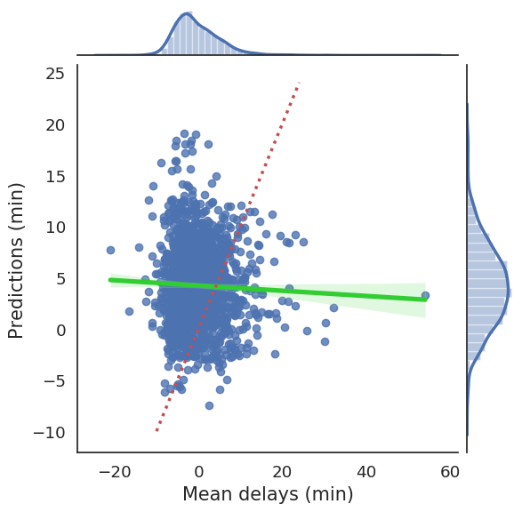


# Conclusion <a name="conclusion"></a>

These notebook was two-fold. The first part dealt with an exploration of the dataset, with the aim of understanding some properties of the delays registered by flights. The second part of the notebook consisted in the elaboration of a model aimed at predicting flight delays. For that purpose, we used polynomial regressions and showed the importance of regularisation techniques. In fact, only ridge regression is used but it is important to keep in mind that other regularisations techniques could be more appropriate ( e.g Lasso or Elastic net). 


```python
# import dill
#dill.dump_session('predict_flight_env.db')
# dill.reload_session('predict_flight_env.db')
```
